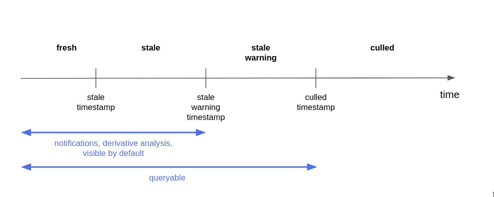

Host Based Inventory (HBI) is the “source of truth” for system, or host,
information across the entire platform. HBI is the primary target for
all incoming data from the various reporters, like `  insights-client  `
, `  RHSM  ` , `  Satellite  ` , etc…, and as such it exposes *Ingress*
APIs for creating, updating and deleting host information. Conversely,
HBI is the primary source of host information for all Applications built
on the platform and as such it also exposes *Egress* APIs for retrieving
host information. There are multiple types of APIs:

1.  *REST APIs* for synchronous operations

2.  *GraphQL API* for synchronous read-only operations. See [Cross Join
    Query API](../xjoin/#available-queries) for details

3.  *Message Queue (MQ) APIs* for asynchronous notifications of data and
    state changes

## Message Queue (MQ) APIs

Inventory consumes incoming messages from ` 
platform.inventory.host-ingress  ` topic and creates / updates host
records based on these messages.

Inventory produces messages to the following topics:

  - `  platform.inventory.events  `

  - `  platform.inventory.host-egress  `

These topics allow applications to keep track of application state
changes in inventory.

 

### MQ Host Insertion

A single host object should be wrapped in an `  operation  ` json
document and sent to the kafka message queue.

    {
       "operation": "add_host",
       "platform_metadata": "<json_doc>",
       "data": {
          "display_name": "<display_name>",
          "ansible_host": "<ansible_host>",
          "account": "<account>",
          "insights_id": "<insights_id>",
          "rhel_machine_id": "<rhel_machine_id>",
          "subscription_manager_id": "<subscription_manager_id>",
          "satellite_id": "<satellite_id>",
          "fqdn": "<fqdn>",
          "bios_uuid": "<bios_uuid>",
          "ip_addresses": [<ip_addresses>],
          "mac_addresses": [<mac_addresses>],
          "external_id": "<external_id>",
          "facts": [<facts>],
          "tags": {<tags>},
          "system_profile": {<system_profile>},
          "stale_timestamp": "<stale_timestamp>",
          "reporter": "<reporter>",
       }
    }

  - operation: name of the operation to perform (“add\_host” is only
    supported currently)

  - platform\_metadata: an optional JSON doc that can be used to pass
    data associated with the host from the ingress service to the
    backend applications (request\_id, S3 bucket URL, etc)

  - data: a host JSON doc as defined by the [model
    HostSchema](https://github.com/RedHatInsights/insights-host-inventory/blob/04bb3cea56dc9bc5f8b2e6469e8ff75080b07b3b/app/models.py#L315)

In the host data, `  account  ` , `  stale_timestamp  ` and `  reporter
 ` are required. In addition to that, at least one canonical fact must
be present. Canonical facts fields are `  insights_id  ` , ` 
rhel_machine_id  ` , `  subscription_manager_id  ` , `  satellite_id  `
, `  bios_uuid  ` , `  ip_addresses  ` , `  fqdn  ` , `  mac_addresses
 ` and `  external_id  ` .

Host `  tags  ` can be passed in one of the following formats:

  - DEPRECATED: An array of structured tag data, each tag value being a
    single object.
    
    

    
    

    
        "tags": [{"namespace": "<namespace>", "key": "<key>", "<value>"}, …]
    
    

    
    

  - PREFERRED: An object of nested tag data, each namespace being an
    object, each key having a list of values.
    
    

    
    

    
        "tags": {"<namespace>": {"<key>": ["<value>", …], …}, …}
    
    

    
    

    
    This format can be used to delete a namespace by explicitly passing
    it with an empty object.
    
    

    
    

    
        "tags": {"<namespace>": {}, …}
    
    

    
    

The kafka topic for adding hosts is `  platform.inventory.host-ingress
 ` .

The `  platform_metadata  ` field will be passed from the incoming
message to the outgoing event message. The data within the ` 
platform_metadata  ` will not be persisted to the database. If the ` 
platform_metadata  ` contains a request\_id field, the value of the
request\_id will be associated with all of the log messages produced by
the service.

The Inventory service will write an event to the ` 
platform.inventory.host-egress  ` kafka topic as a result of adding or
updating a host over the message queue.

    {
       "type": "created",
       "platform_metadata": "<metadata_json_doc>",
       "host": {
          "id": "<id>",
          "subscription_manager_id": "<subscription_manager_id>",
          "ansible_host": "<ansible_host>",
          "display_name": "<display_name>",
          "reporter": "<reporter>",
          "stale_timestamp": "<stale_timestamp>",
          "tags": [<tags>],
          "system_profile": <system_profile>
       }
    }

  - `  type  ` : result of the add host operation (“created” and
    “updated” are only supported currently)

  - `  platform_metadata  ` : a json doc that contains the metadata
    associated with the host (s3 url, request\_id, etc)

  - `  host  ` : a host json doc as defined by the [Egress
    HostSchema](https://github.com/RedHatInsights/insights-host-inventory/blob/04bb3cea56dc9bc5f8b2e6469e8ff75080b07b3b/app/queue/egress.py#L69)

Host `  tags  ` are output in the structured format – as a list of
objects, one for each tag value.

## REST APIs

The REST API is described by an [OpenAPI specification
file](https://cloud.redhat.com/docs/api/inventory) .

### Host Create / Update

Hosts are created and updated via `  POST /hosts  ` . (See the [API
Documentation](https://cloud.redhat.com/docs/api/inventory) for more
details on the POST method). This method returns an `  id  ` which
should be used to reference the host by other services in the Insights
platform.

The REST api should \_not\_ be used for insertion. Instead, a batch of
hosts should be added to the inventory system by sequentially writing
the individual hosts to the kafka message queue (see above).

 

### Host Deletion

Hosts can be deleted by using the [DELETE HTTP
method](https://cloud.redhat.com/docs/api/inventory#operations-hosts-api\\.host\\.delete_by_id)
resource. When a host is deleted, the inventory service sends an event
message to the `  platform.inventory.events  ` topic. The delete event
message looks like the following:

    {
      "id": "<host id>",
      "timestamp": "<delete timestamp>",
      "type": "delete",
      "account": "<account number>",
      "insights_id": "<insights id>",
      "request_id": "<request id>"
    }

  - type: type of host change (delete in this case)

  - id: Inventory host id of the host that was deleted

  - timestamp: the time at which the host was deleted

  - account: the account number associated with the host that was
    deleted

  - insights\_id: the insights\_id of the host that was deleted

  - request\_id: the request\_id from the DELETE REST invocation that
    triggered the delete message

### Host Patching

The `  ansible_host  ` and `  display_name  ` fields can be updated by
sending a [PATCH
request](https://cloud.redhat.com/docs/api/inventory#operations-hosts-api\\.host\\.patch_by_id)
to the inventory REST API. When an update is performed, the inventory
service sends a message to the `  platform.inventory.events  ` topic.
Although a PATCH request can only change `  ansible_host  ` and ` 
display_name  ` fields, the message sent to the topic will include the
entire representation of the host at the time of the change. Here is an
example of the updated message:

    {
       "type": "updated",
       "metadata": {
           "request_id": "<request_id>",
       },
       "host": {
          "id": "<id>",
          "display_name": "<display_name>",
          "ansible_host": "<ansible_host>",
          "account": "<account_number>",
          "insights_id": "<insights_id>",
          "rhel_machine_id": "<rhel_machine_id>",
          "subscription_manager_id": "<subscription_manager_id>",
          "satellite_id": "<satellite_id>",
          "fqdn": "<fqdn>",
          "bios_uuid": "<bios_uuid>",
          "ip_addresses": [<ip_addresses>],
          "mac_addresses": [<mac_addresses>],
          "external_id": "<external_id>",
          "stale_timestamp": "<stale_timestamp>",
          "reporter": "<reporter>",
          "tags": [<tags>],
          "system_profile": {<system_profile>}
       }
    }

Note that unlike the `  updated  ` message in
[ MQ Host Insertion
](#inventory-mq-ingest) this message does not include a ` 
platform_metadata  ` field. There is however a `  metadata  ` field that
includes the `  request_id  ` .

## Other HBI Functionality

In addition to providing APIs for modifying and retrieving host
information, HBI also performs some key internal operations whose
behaviors described in the sections that follow.

### Host Deduplication

The Insights Inventory service is responsible for storing information
about hosts and deduplicating hosts as they are reported. The Inventory
service uses the canonical facts to perform the deduplication. The
canonical facts are:

  - insights\_id

  - rhel\_machine\_id

  - subscription\_manager\_id

  - satellite\_id

  - bios\_uuid

  - ip\_addresses

  - fqdn

  - mac\_addresses

  - external\_id

If the update request includes an insights\_id, then the inventory
service will lookup the host using the insights\_id. If the inventory
service finds a host with a matching insights\_id, then the host will be
updated and the canonical facts from the update request will replace the
existing canonical facts.

If the update request does not include an insights\_id, then the
canonical facts will be used to lookup the host. If the canonical facts
from the update request are a subset or a superset of the previously
stored canonical facts, then the host will be updated and any new
canonical facts from the request will be added to the existing host
entry.

If the canonical facts based lookup does not locate an existing host,
then a new host entry is created.

Tag namespaces of the updated host are merged with those of the reported
one. New reported tag namespaces are added to the existing host;
reported namespaces that already exist in the existing host are
replaced, the tags themselves are not merged. If an empty namespace is
explicitly reported, it is deleted from the existing host.

### Host Staleness and Culling

HBI may at any time stop receiving updates about a given host (e.g. a
virtual machine may be removed). Inventory implements a mechanism that
ensures that a host record is removed after a certain period of
inactivity.

Every host has a culling information associated to it. It consists of a
timestamp and a reporter identifier. The *stale\_timestamp* field is a
point of time from which the host is considered stale. **This timestamp
is always updated to the timestamp sent by the latest reporter.**

Relatively to its timestamp, each host is in one of these staleness
states:

  - *fresh* if the *stale\_timestamp* is in the future

  - *stale* if the *stale\_timestamp* has already lapsed, but no longer
    than 7 days ago

  - *stale\_warning* if the host is stale for at least 7 days, but has
    not yet been culled

  - *culled* if the host is stale for at least 14 days

For every host HBI defines 3 timestamps:

  - *stale\_timestamp*

  - *stale\_warning\_timestamp*

  - *culled\_timestamp*

These timestamps mark the boundaries of staleness states of a host.

By default, only hosts that are *fresh* or *stale* are considered by
[/hosts](https://cloud.redhat.com/docs/api/inventory#operations-hosts-api.host.get_host_list)
and
[/tags](https://cloud.redhat.com/docs/api/inventory#operations-tags-api.tag.get_tags)
operations. This behavior can be overridden using the *staleness* filter
which can be set to any (comma separated) combination of *fresh* ,
*stale* , *stale\_warning* .

Culled hosts are considered non-existent and are by no means available
through the API. They are subject to automatic deletion done by a
scheduled Reaper job.

The *Host Reaper* is run every hour and physically deletes culled hosts
from the database. For every deleted host a *platform.inventory.events*
event of type *delete* is emitted. (See [ Host
Deletion ](#inventory-delete) for details)

Applications integrating with HBI:

  - must treat hosts in the *culled* state as non-existent

  - must by default only return hosts that are *fresh* or *stale* from
    any list API operation

  - may provide a *staleness* filter to override the default behavior of
    list API operations (see above)

  - should not perform derivative analysis on hosts that are not *fresh*
    or *stale*

  - should not produce customer-facing notifications or alerts about
    host that are not *fresh* or *stale*

### Testing API Calls

It is necessary to pass an authentication header along on each call to
the service. For testing purposes, it is possible to set the required
identity header to the following:

    x-rh-identity: eyJpZGVudGl0eSI6IHsiYWNjb3VudF9udW1iZXIiOiAiMDAwMDAwMSIsICJpbnRlcm5hbCI6IHsib3JnX2lkIjogIjAwMDAwMSJ9fX0=

This is the Base64 encoding of the following JSON document:

    {"identity": {"account_number": "0000001", "internal": {"org_id": "000001"}}}

## Contributing

If you’re interested in contributing, check out the Github repo:
<https://github.com/RedHatInsights/insights-host-inventory>

