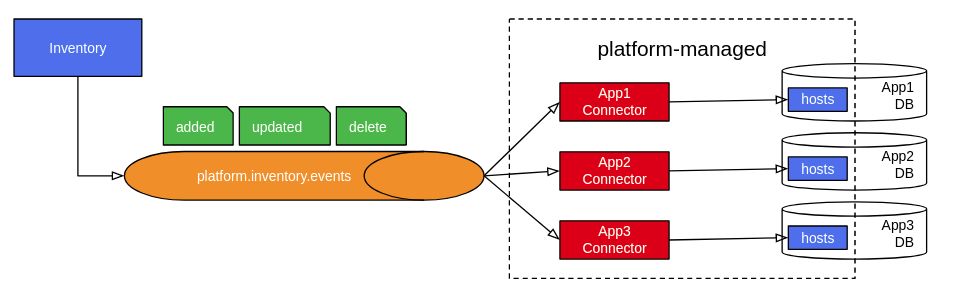

Host Based Inventory (HBI) is the source of truth for system, or host,
information across the entire platform. HBI consumes information about
hosts from reporters, like `  insights-client  ` , `  RHSM  ` or ` 
Satellite  ` . In a process known as [host
deduplication](#host-deduplication) the identity of a host is
determined. Afterwards, information about the host is persisted.

Information stored by HBI can be accessed in multiple ways:

1.  [REST Interface](#rest-interface) for synchronous operations

2.  [GraphQL Interface](../xjoin/#available-queries) for synchronous
    read-only operations

3.  [Event Interface](#event-interface) for asynchronous notifications
    of data and state changes

4.  [Host data syndication](#cyndi)

 

## Host Insertion

Inventory consumes messages from host ingress topics and creates /
updates host records based on these messages.

There are multiple host ingress topics. All the topics share the same
payload format. They differ in the priority in which messages are
processed by HBI. Each topic is associated with a separate pool of
consumers, each with its own resource allocation. That allows uploads
that require minimal latency (e.g. an upload manually initiated by a
customer) to be processed before other types of host messages. The
following table summarizes available host ingress topics:

<table style="width:99%;">
<colgroup>
<col style="width: 33%" />
<col style="width: 33%" />
<col style="width: 33%" />
</colgroup>
<thead>
<tr class="header">
<th>
Topic
</th>
<th>
Description
</th>
<th>
Reporters using this topic
</th>
</tr>
</thead>
<tbody>
<tr class="odd">
<td>
<code class="docutils literal notranslate">                   platform.inventory.host-ingress-p1                 </code>
</td>
<td>
High priority topic. Reserved for host messages where minimal latency is required.
</td>
<td>
puptoo
</td>
</tr>
<tr class="even">
<td>
<code class="docutils literal notranslate">                   platform.inventory.host-ingress                 </code>
</td>
<td>
Messages are processed with default priority. Suitable for reporters that produce host messages in batches or where real-time processing is not necessary.
</td>
<td>
rhsm, yupana
</td>
</tr>
</tbody>
</table>

For each host ingress message HBI:

1.  performs [host deduplication](#host-deduplication)

2.  stores or updates the host record

3.  produces a [created event](#created-event) or [updated
    event](#updated-event)

### Expected message format

HBI expects the host ingress messages to comply with the following
format.

A single host object should be wrapped in an `  operation  ` json
document.

    {
       "operation": "add_host",
       "platform_metadata": "<json_doc>",
       "data": {
          "display_name": "<display_name>",
          "ansible_host": "<ansible_host>",
          "account": "<account>",
          "insights_id": "<insights_id>",
          "rhel_machine_id": "<rhel_machine_id>",
          "subscription_manager_id": "<subscription_manager_id>",
          "satellite_id": "<satellite_id>",
          "fqdn": "<fqdn>",
          "bios_uuid": "<bios_uuid>",
          "ip_addresses": [<ip_addresses>],
          "mac_addresses": [<mac_addresses>],
          "external_id": "<external_id>",
          "facts": [<facts>],
          "tags": {<tags>},
          "system_profile": {<system_profile>},
          "stale_timestamp": "<stale_timestamp>",
          "reporter": "<reporter>",
       }
    }

  - operation: name of the operation to perform (“add\_host” is only
    supported currently)

  - platform\_metadata: an optional JSON doc that can be used to pass
    data associated with the host from the ingress service to the
    backend applications (request\_id, S3 bucket URL, etc)

  - data: a host JSON doc as defined by the [model
    HostSchema](https://github.com/RedHatInsights/insights-host-inventory/blob/04bb3cea56dc9bc5f8b2e6469e8ff75080b07b3b/app/models.py#L315)

In the host data, the following fields are required:

  - `  account  `

  - `  stale_timestamp  `

  - `  reporter  `

In addition, at least one canonical fact must be present. Canonical
facts fields are:

  - `  insights_id  `

  - `  subscription_manager_id  `

  - `  fqdn  `

  - `  rhel_machine_id  `

  - `  satellite_id  `

  - `  bios_uuid  `

  - `  ip_addresses  `

  - `  mac_addresses  `

  - `  external_id  `

Host `  tags  ` should be provided using [nested
representation](#nested-representation)

> 
> 
> 

> 
> 

> 
> 

> 
>     "tags": {"<namespace>": {"<key>": ["<value>", …], …}, …}
> 
> 

> 
> 

> 
> This format can be used to delete a namespace by explicitly passing it
> with an empty object.
> 
> 

> 
> 

> 
>     "tags": {"<namespace>": {}, …}
> 
> 

> 
> 

> 
> 

Note

HBI also accepts host tags in the [structured
representation](#structured-representation) . However, the use of this
representation of tags for host ingress is **DEPRECATED** and the
support will be removed in the future.

The `  platform_metadata  ` field will be passed from the incoming host
ingress message to the outgoing event message. The data within the ` 
platform_metadata  ` will not be persisted to the database. If the ` 
platform_metadata  ` contains a request\_id field, the value of the
request\_id will be associated with all of the log messages produced by
the service.

 

### Validation of ingress messages

Messages consumed from host ingress topics are validated against the
expected message format. Messages that don’t pass validation are
rejected by HBI.

Multiple tools are set up to help with analysis of rejected messages:

1.  A summary of rejected messages for each reporter is available in the
    HBI Grafana Dashboards
    
      - [prod Grafana
        Dashboard](https://grafana.app-sre.devshift.net/d/EiIhtC0Wa/inventory?orgId=1&var-datasource=crcp01ue1-prometheus)
    
      - [stage Grafana
        Dashboard](https://grafana.app-sre.devshift.net/d/EiIhtC0Wa/inventory?orgId=1&var-datasource=crc-stg-01-prometheus)

2.  Individual validation errors can be examined in the HBI logs
    
      - [prod
        Kibana](https://kibana.apps.crcp01ue1.o9m8.p1.openshiftapps.com/app/kibana#/discover?_g=\(refreshInterval:\(pause:!t,value:0\),time:\(from:now-12h,to:now\)\)&_a=\(columns:!\(_source\),filters:!\(\),index:'43c5fed0-d5ce-11ea-b58c-a7c95afd7a5d',interval:auto,query:\(language:kuery,query:'@log_stream:%20%22inventory-mq-*%22%20AND%20message:%20%22Error%20adding%20host%20%22'\),sort:!\(!\('@timestamp',desc\)\)\))
    
      - [stage
        Kibana](https://kibana.apps.crc-stg-01.o4v9.p1.openshiftapps.com/app/kibana#/discover?_g=\(filters:!\(\),refreshInterval:\(pause:!t,value:0\),time:\(from:now-12h,to:now\)\)&_a=\(columns:!\(_source\),filters:!\(\),index:'09714760-d855-11ea-9f21-6b7e641a18be',interval:auto,query:\(language:kuery,query:'@log_stream:%20%22inventory-mq-*%22%20AND%20message:%20%22Error%20adding%20host%20%22'\),sort:!\(!\('@timestamp',desc\)\)\))

3.  Validation errors that cause a payload to be rejected are also
    reported through Payload tracker
    
      - [prod Payload
        Tracker](https://payload-tracker-frontend-payload-tracker-prod.apps.crcp01ue1.o9m8.p1.openshiftapps.com/statuses?status=processing_error&service=inventory-mq-service&page=1)
    
      - [stage Payload
        Tracker](https://payload-tracker-frontend-payload-tracker-stage.apps.crc-stg-01.o4v9.p1.openshiftapps.com/statuses?status=processing_error&service=inventory-mq-service&page=1)

## Event Interface

For any host state change HBI produces an event. These events allow
applications and other platform components to get information about
hosts and keep up as changes happen.

There are three types of events HBI produces: `  created  ` , `  updated
 ` and `  delete  ` . All the events are sent as kafka messages to the
`  platform.inventory.events  ` kafka topic.

Note

The `  created  ` and `  updated  ` events are also sent to the ` 
platform.inventory.host-egress  ` topic. This topic is **DEPRECATED**
and will be removed in the future.

Every event uses the host identifier as the kafka message key. The kafka
message value is specific to each event type and is described below.

In addition, each kafka message defines a set of headers:

  - `  event_type  ` - indicates the type of the event ( `  created  ` ,
    `  updated  ` or `  delete  ` )

  - `  request_id  ` - the request id of the event or -1 for events that
    do not originate from a request

  - `  producer  ` - indicates the hostname of the pod that produced the
    message

  - `  insights_id  ` - the insights id of the host associated with the
    message or an empty string if host does not have an insights id

### Created event

The `  created  ` event is produced any time a new host record is
created.

    {
       "type": "created",
       "platform_metadata": "<metadata_json_doc>",
       "metadata": {
           "request_id": "<request_id>",
       },
       "host": {
          "id": "<id>",
          "account": "<account_number>",
          "display_name": "<display_name>",
          "ansible_host": "<ansible_host>",
          "fqdn": "<fqdn>",
          "insights_id": "<insights_id>",
          "stale_timestamp": "<stale_timestamp>",
          "reporter": "<reporter>",
          "tags": [<tags>],
          "system_profile": {<system_profile>}
       }
    }

  - `  type  ` : identifies the type of the event

  - `  platform_metadata  ` : an optional json doc that contains the
    metadata associated with the host (s3 url, request\_id, etc)

  - `  host  ` : a host json doc as defined by the [Egress
    HostSchema](https://github.com/RedHatInsights/insights-host-inventory/blob/04bb3cea56dc9bc5f8b2e6469e8ff75080b07b3b/app/queue/egress.py#L69)

Host `  tags  ` are formatted in the [structured
representation](#structured-representation)

### Updated event

The `  updated  ` event is produced any time changes are made to an
existing host record.

    {
       "type": "updated",
       "platform_metadata": "<metadata_json_doc>",
       "metadata": {
           "request_id": "<request_id>",
       },
       "host": {
          "id": "<id>",
          "account": "<account_number>",
          "display_name": "<display_name>",
          "ansible_host": "<ansible_host>",
          "fqdn": "<fqdn>",
          "insights_id": "<insights_id>",
          "stale_timestamp": "<stale_timestamp>",
          "reporter": "<reporter>",
          "tags": [<tags>],
          "system_profile": {<system_profile>}
       }
    }

The full representation of the updated host (even fields that did not
change) is sent always. The format is identical to the [created
event](#created-event) . The only difference is the event type.

### Delete event

The `  delete  ` event is produced when a host record is removed from
HBI.

    {
      "type": "delete",
      "id": "<host id>",
      "timestamp": "<delete timestamp>",
      "account": "<account number>",
      "insights_id": "<insights id>",
      "request_id": "<request id>"
    }

  - `  type  ` : identifies the event type

  - `  id  ` : Inventory host id of the host that was deleted

  - `  timestamp  ` : the time at which the host was deleted

  - `  account  ` : the account number associated with the host that was
    deleted

  - `  insights_id  ` : the insights\_id of the host that was deleted

  - `  request_id  ` : the identifier of the request that removed the
    host record (if applicable)

## REST Interface

The REST Interface allows host records to be read and altered using
HTTP. The interface is described by an [OpenAPI specification
file](https://cloud.redhat.com/docs/api/inventory) .

### Host Create / Update

Note

Host creation through the REST API is **DEPRECATED** and will be
disabled soon. Instead, use [ Host Insertion
](#inventory-mq-ingest) to create / update hosts.

Hosts are created and updated via `  POST /hosts  ` . (See the [API
Documentation](https://cloud.redhat.com/docs/api/inventory) for more
details on the POST method). This method returns an `  id  ` which
should be used to reference the host by other services in the Insights
platform.

The REST api should \_not\_ be used for insertion. Instead, a batch of
hosts should be added to the inventory system by sequentially writing
the individual hosts to the kafka message queue (see above).

### Host Patching

The `  ansible_host  ` and `  display_name  ` fields can be updated by
sending a [PATCH
request](https://cloud.redhat.com/docs/api/inventory#operations-hosts-api\\.host\\.patch_by_id)
to the inventory REST API.

When an update is performed, the inventory service produces an [updated
event](#updated-event) . Note that in this case the event body does not
include a `  platform_metadata  ` field. There is however a `  metadata
 ` field that includes the `  request_id  ` .

 

### Host Deletion

Hosts can be deleted by using the [DELETE HTTP
method](https://cloud.redhat.com/docs/api/inventory#operations-hosts-api\\.host\\.delete_by_id)
resource. When a host is deleted, the inventory service produces a
[delete event](#delete-event) .

### Testing API Calls

It is necessary to pass an authentication header along on each call to
the service. For testing purposes, it is possible to set the required
identity header to the following:

    x-rh-identity: eyJpZGVudGl0eSI6IHsiYWNjb3VudF9udW1iZXIiOiAiMDAwMDAwMSIsICJpbnRlcm5hbCI6IHsib3JnX2lkIjogIjAwMDAwMSJ9fX0=

This is the Base64 encoding of the following JSON document:

    {"identity": {"account_number": "0000001", "internal": {"org_id": "000001"}}}

## Host Deduplication

The Inventory service is responsible for storing information about hosts
and deduplicating hosts as they are reported. The Inventory service uses
the canonical facts to perform the deduplication. The canonical facts
are:

  - `  insights_id  `

  - `  subscription_manager_id  `

  - `  fqdn  `

  - `  rhel_machine_id  `

  - `  satellite_id  `

  - `  bios_uuid  `

  - `  ip_addresses  `

  - `  mac_addresses  `

  - `  external_id  `

If the update request includes an insights\_id, then the inventory
service will lookup the host using the insights\_id. If the inventory
service finds a host with a matching insights\_id, then the host will be
updated and the canonical facts from the update request will replace the
existing canonical facts.

If the update request does not include an insights\_id, then the
canonical facts will be used to lookup the host. If the canonical facts
from the update request are a subset or a superset of the previously
stored canonical facts, then the host will be updated and any new
canonical facts from the request will be added to the existing host
entry.

If the canonical facts based lookup does not locate an existing host,
then a new host entry is created.

Tag namespaces of the updated host are merged with those of the reported
one. New reported tag namespaces are added to the existing host;
reported namespaces that already exist in the existing host are
replaced, the tags themselves are not merged. If an empty namespace is
explicitly reported, it is deleted from the existing host.

## Host Staleness and Culling

HBI may at any time stop receiving updates about a given host (e.g. a
virtual machine may be removed). Inventory implements a mechanism that
ensures that a host record is removed after a certain period of
inactivity.

Every host has a culling information associated to it. It consists of a
timestamp and a reporter identifier. The *stale\_timestamp* field is a
point of time from which the host is considered stale. **This timestamp
is always updated to the timestamp sent by the latest reporter.**

Relatively to its timestamp, each host is in one of these staleness
states:

  - *fresh* if the *stale\_timestamp* is in the future

  - *stale* if the *stale\_timestamp* has already lapsed, but no longer
    than 7 days ago

  - *stale\_warning* if the host is stale for at least 7 days, but has
    not yet been culled

  - *culled* if the host is stale for at least 14 days

For every host HBI defines 3 timestamps:

  - *stale\_timestamp*

  - *stale\_warning\_timestamp*

  - *culled\_timestamp*

These timestamps mark the boundaries of staleness states of a host.

By default, only hosts that are *fresh* or *stale* are considered by
[/hosts](https://cloud.redhat.com/docs/api/inventory#operations-hosts-api.host.get_host_list)
and
[/tags](https://cloud.redhat.com/docs/api/inventory#operations-tags-api.tag.get_tags)
operations. This behavior can be overridden using the *staleness* filter
which can be set to any (comma separated) combination of *fresh* ,
*stale* , *stale\_warning* .

Culled hosts are considered non-existent and are by no means available
through the API. They are subject to automatic deletion done by a
scheduled Reaper job.

The *Host Reaper* is run every hour and physically deletes culled hosts
from the database. For every deleted host [delete event](#delete-event)
is emitted.

Applications integrating with HBI:

  - must treat hosts in the *culled* state as non-existent

  - must by default only return hosts that are *fresh* or *stale* from
    any list API operation

  - may provide a *staleness* filter to override the default behavior of
    list API operations (see above)

  - should not perform derivative analysis on hosts that are not *fresh*
    or *stale*

  - should not produce customer-facing notifications or alerts about
    host that are not *fresh* or *stale*

 

## Tags

A tag‌ ‌represent‌s ‌user-defined‌ ‌metadata‌ ‌about‌ a ‌host.‌ HBI
stores a set of tags defined for each host.

### Tag structure

A tag consists of three segments: *namespace* , *key* and a set of
*values* .

The namespace, key and each of the values is:

  - a string of at least 1 and no more than 255 Unicode characters in
    UTF-8

  - case-sensitive

In addition

  - namespace and key are mandatory segments of a tag

  - a tag may define zero, one or multiple values

  - the order of tag values is not significant

### Tag representation

There are three standard representations of host tags. Each of these
representations has different properties and is therefore better suited
for certain situations. The following tag is used across the examples
below to demonstrate how the representations differ.

  - namespace = `  insights-client  `

  - key = `  env  `

  - value = `  prod  `

#### Structured representation

This is the default representation of tags and is preferred for tag data
exchange using REST or event interfaces.

A tag is represented by one or more objects, each explicitly defining
the namespace, key and value:

    {
       "namespace": "insights-client",
       "key": "env",
       "value": "prod"
    }

If a tag defines no values then this is indicated with `  "value": null
 ` .

A tag with multiple values ( prod , stage ) is represented as two
separate objects:

    [{
       "namespace": "insights-client",
       "key": "env",
       "value": "prod"
    }, {
       "namespace": "insights-client",
       "key": "env",
       "value": "stage"
    }]

#### Nested representation

In the nested representation the tags are represented as an object with
three levels of nesting. These levels correspond to namespace, key and
values, respectively.

    {
       "insights-client": {
          "env": [
             "prod"
          ]
       }
    }

If a tag defines no values then this is indicated with empty array on
the third level:

    {
       "insights-client": {
          "env": []
       }
    }

A tag with multiple values ( prod , stage ) lists all the values in the
third level array:

    {
       "insights-client": {
          "env": [
             "prod",
             "stage"
          ]
       }
    }

#### String representation

In certain situations a single-string representation of a namespace +
key + value may be preferred. For example, when sending tag information
using HTTP query parameters.

In the string representation the namespace, key and value are
concatenated. `  /  ` and `  =  ` are used as control characters to
separate the individual segments.

    insights-client/env=prod

The fact that a namespace, key or value can contain `  /  ` and `  =  `
characters creates a potential ambiguity when parsing a tag in the
string representation. In order to avoid this ambiguity it is required
that `  /  ` and `  =  ` characters that occur in the namespace, key or
value are escaped using RFC3986 (URI encoding). More specifically, when
transforming a tag into the string representation the following rules
apply for namespace, key or value:

  - `  /  ` is replaced with `  %2F  `

  - `  =  ` is replaced with `  %3D  `

For example, the following tag:

  - namespace: `  insights-client  `

  - key: `  selinux-config  `

  - value: `  SELINUX=enforcing  `

is represented using string representation as:

    insights-client/selinux-config=SELINUX%3Denforcing

Note that in transit (e.g. when sent as an HTTP query parameter value)
the tag will be URI-encoded again (as required by RFC3986). This happens
automatically in modern HTTP browsers and http client libraries. This
should not be confused with the aforementioned encoding of the tag
segments described above which the client must always do.

If a tag defines no values then this is indicated as ` 
insights-client/env  `

A tag with multiple values ( prod , stage ) is represented with multiple
String instances (e.g. in case of HTTP query parameters)

    GET /hosts?tags=insights-client/env=prod&tags=insights-client/env=stage

### Using Tags in queries

This section defines semantics of query operations that involve tags.
For consistency it is vital that applications integrating with HBI
follow these guidelines.

#### Filtering hosts by tags

A common use-case for tags is to use them for filtering of hosts.
Besides filtering a list of hosts directly, tags can be used to filter
aggregations (count of hosts with the given tag), associated information
(CVEs that apply to the hosts with the given tag), etc.

The tag that is used for filtering is said to be the *requested tag* .
An *available tag* is any tag associated with a given system.

A host is considered to match the requested tag if and only if an
available tag is defined by the hosts which:

  - defines a namespace that is equal to the namespace of the requested
    tag

  - defines a key that is equal to the key of the requested tag

  - defines a set of values that matches the values of the requested tag
    
      - the set of values of the requested tag is an empty set and the
        available tag defines no values, or
    
      - the set of values of the requested tag is a non-empty set and
        this set is a subset of values defined by the available tag

It is possible to filter by multiple tags at the same time. In that
case, a host must match all the requested tags.

See
[/hosts](https://cloud.redhat.com/docs/api/inventory#operations-hosts-api.host.get_host_list)
for the reference implementation of host filtering based on tags.

##### Examples

Assume the following set of hosts

<table>
<colgroup>
<col style="width: 50%" />
<col style="width: 50%" />
</colgroup>
<thead>
<tr class="header">
<th>
Host
</th>
<th>
Tags defined by the host
</th>
</tr>
</thead>
<tbody>
<tr class="odd">
<td>
example01
</td>
<td>

<pre><code>insights-client/http-server
insights-client/env=prod</code></pre>

</td>
</tr>
<tr class="even">
<td>
example02
</td>
<td>

<pre><code>insights-client/http-server=cgi
insights-client/env=prod
insights-client/env=stage</code></pre>

</td>
</tr>
<tr class="odd">
<td>
example03
</td>
<td>

<pre><code>insights-client/http-server=cgi
insights-client/http-server=tls
insights-client/http-server=http2
insights-client/env=stage</code></pre>

</td>
</tr>
</tbody>
</table>

A sample query of `  /hosts?tags=insights-client/env=prod  ` matches two
hosts (example01, example02). In this case the requested tag defines

  - namespace = `  insights-client  `

  - key = `  env  `

  - value = `  prod  `

example01 and example02 both match the requested tag because they both
define a tag that

  - defines the same namespace ( `  insights-client  ` )

  - defines the same key ( `  env  ` )

  - defines a set of values ( `  {prod}  ` in case of example01, ` 
    {prod, stage}  ` in case of example02) that matches the values of
    the requested tag ( `  {prod}  ` )
    
      - `  {prod}  ` is a subset of `  {prod}  ` and `  {prod  ` , ` 
        stage}  `

example03 does not match because while it defines a tag whose namespace
and key match ( `  insights-client/env=stage  ` ), its values do not
match the requested tag ( `  {prod}  ` is not empty neither is a subset
of `  {stage}  ` ).

The following table summarizes other combinations of requested tags and
matched hosts:

<table>
<colgroup>
<col style="width: 50%" />
<col style="width: 50%" />
</colgroup>
<thead>
<tr class="header">
<th>
Requested tags
</th>
<th>
Matched hosts
</th>
</tr>
</thead>
<tbody>
<tr class="odd">
<td>

<pre><code>insights-client/http-server=cgi</code></pre>

</td>
<td><ul>
<li>
example02
</li>
<li>
example03
</li>
</ul></td>
</tr>
<tr class="even">
<td>

<pre><code>insights-client/http-server=cgi
insights-client/http-server=tls</code></pre>

</td>
<td><ul>
<li>
example03
</li>
</ul></td>
</tr>
<tr class="odd">
<td>

<pre><code>insights-client/http-server</code></pre>

</td>
<td><ul>
<li>
example01
</li>
</ul></td>
</tr>
<tr class="even">
<td>

<pre><code>insights-client/http-server
insights-client/env=stage</code></pre>

</td>
<td>
no hosts matched
</td>
</tr>
</tbody>
</table>

##### Query syntax

Applications integrating with HBI that provide a tag-based filtering
capability via a REST interface should implement an HTTP query parameter
named `  tags  ` .

    ?tags=insights-client/env=prod

Filtering by a combination of multiple tags or by a tag with multiple
values should be supported by the tags parameter accepting multiple
values.

    ?tags=insights-client/env=prod&tags=insights-client/http-server=cgi

## System Profile

HBI stores a set of currated facts, also known as *system profile* , for
each host. The system profile contains general facts about a host such
as OS version, Kernel version, CPU architecture, etc.

The system profile is stored and represented as a dictionary with a
well-defined schema. The schema is stored and developed independently of
HBI [in a separate
repository](https://github.com/RedHatInsights/inventory-schemas/tree/master/schemas/system_profile)
.

System profile facts are reported by reporters in the [host
insertion](#host-insertion) process. All the system profile facts are
optional, i.e. a reporter does not need to specify any. If a reporter
does specify a system profile fact then it’s value overrides previously
stored value of the given fact (if any). Any previously stored system
profile facts that a reporter does not define remain unchanged.

### Using System Profile in queries

Applications integrating with HBI may provide querying capabilities that
use system profile facts for host filtering. Applications that do so via
a REST interface should follow a standardized format in order for
consistency to be achieved across applications.

To filter based on system profile facts, applications should define a
query parameter named `  filter  ` . The query parameter should be of
type [deep object](https://swagger.io/docs/specification/serialization)
and follow the [generic filter query parameter
syntax](https://github.com/RedHatInsights/insights-api-common-rails#usage)
.

For example, to query for hosts with x86-64 architecture the query
parameter should be defined as:

    ?filter[system_profile][arch]=x86-64

or with explicit operator definition

    ?filter[system_profile][arch][eq]=x86-64

To query for hosts whose operating system version major version is 8
should be defined as:

    ?filter[system_profile][os_release][starts_with]=8

See the [generic filter query parameter
syntax](https://github.com/RedHatInsights/insights-api-common-rails#usage)
for more details.

 

## Host Data Syndication (a.k.a. Project Cyndi)

Note

Project Cyndi and this section are work in progress. If you have
questions contact
[@project-cyndi-dev](https://app.slack.com/client/T026NJJ6Z/browse-user-groups/user_groups/S014H1A3AH0)
directly.

Besides accessing host data via HBI interfaces, it is possible to
syndicate host data directly into an application database. This is
especially useful when host data needs to be joined with
application-specific data and filtered based on combination of
app-specific and HBI-specific criteria. Such queries are efficient with
host data syndication as they benefit from the fact that the data is
co-located in a single database.

Applications that use host data syndication have an *inventory* schema
in their database. The schema contains host data and this schema is kept
up to date with HBI as changes are made in HBI. The inventory schema is
completely managed by the Inventory workstream.

### Onboarding process

The onboarding process varies based on the environment. For self-managed
(legacy CI and QA) environments, follow the steps in the next section.
For environments managed by AppSRE via app-interface, skip ahead to
[Onboarding process (App-Interface)](#onboarding-process-app-interface)

#### Onboarding process (Self-managed environment)

In order to integrate an application with Project Cyndi the following
steps need to be followed:

1.  Ensure that the application database matches the following criteria:
    
      - AWS RDS instance of type *large* or better
    
      - PostgreSQL version 10.6 or higher
    
      - At least 200 GiB of free storage capacity

2.  Determine the type of host syndication needed by the application,
    either:
    
    1.  *all* - all inventory hosts are syndicated, or
    
    2.  *insights only* - only Insights hosts are syndicated (i.e. only
        hosts reporting through insights-client)
    
    The latter option should be preferred unless the application also
    processes data related to hosts other than the Insights ones

3.  The application superuser creates an inventory schema in the
    application database
    
    

    
    

    
        CREATE SCHEMA inventory;
    
    

    
    

    
    The inventory schema is where syndicated host data is stored.

4.  The application superuser creates cyndi\_reader and cyndi\_admin
    roles and the cyndi user
    
    

    
    

    
        -- The admin ROLE that allows the inventory schema to be managed
        CREATE ROLE cyndi_admin;
        GRANT ALL PRIVILEGES ON SCHEMA inventory TO cyndi_admin;
        
        -- The reader ROLE that provides SELECT access to the inventory.hosts view
        CREATE ROLE cyndi_reader;
        GRANT USAGE ON SCHEMA inventory TO cyndi_reader;
        
        -- The application user is granted the reader role only to eliminate any interference with Cyndi
        GRANT cyndi_reader to <application username>;
        
        -- Create a user for Cyndi with cyndi_admin ROLE
        -- Used by Project Cyndi to access the database and manage the inventory schema
        CREATE USER cyndi WITH PASSWORD '<password>' IN ROLE cyndi_admin;
    
    

    
    

    
    Where
    
    > 
    > 
    > 

    > 
    >   - \<application username\> is the username used by the
    >     application when accessing the database
    > 
    >   - \<password\> is a newly generated secure password
    > 
    > 

5.  Contact
    [@project-cyndi-dev](https://app.slack.com/client/T026NJJ6Z/browse-user-groups/user_groups/S014H1A3AH0)
    and provide the following information
    
      - application name (e.g. *advisor* )
    
      - desired host syndication type ( *all* or *insights only* )
    
      - database hostname
    
      - database name
    
      - database password for the *cyndi* user

#### Onboarding process (App-Interface)

In order to integrate an application with Project Cyndi the following
steps need to be followed:

1.  Ensure that the application database matches the following criteria:
    
      - AWS RDS instance of type *large* or better
    
      - PostgreSQL version 10.6 or higher
    
      - At least 200 GiB of free storage capacity

2.  Determine the type of host syndication needed by the application,
    either:
    
    1.  *all* - all inventory hosts are syndicated, or
    
    2.  *insights only* - only Insights hosts are syndicated (i.e. only
        hosts reporting through insights-client)
    
    The latter option should be preferred unless the application also
    processes data related to hosts other than the Insights ones

3.  Configure the cyndi-init job that sets up the application database
    to be managed by Cyndi.
    
    1.  Locate the application’s `  app.yml  ` file ( ` 
        data/services/insights/<application name>/app.yml  ` ) and add
        the `  inventory-syndication  ` entry into the `  codeComponents
         ` list:
        
        

        
        

        
            codeComponents:
            - name: inventory-syndication
              resource: upstream
              url: https://github.com/redhatinsights/inventory-syndication
        
        

        
        

    
    2.  Locate the application’s `  deploy.yml  ` file ( ` 
        data/services/insights/<application name>/deploy.yml  ` ) and
        make sure that the `  managedResourceTypes  ` list contains ` 
        Job  ` and `  ConfigMap  ` . Add the missing resource type(s) if
        needed.
        
        

        
        

        
            managedResourceTypes:
            - ConfigMap
            - Job
        
        

        
        

    
    3.  In the `  deploy.yml  ` ensure that `  github-app-sre-bot  ` is
        defined in the `  authentication.code  ` section.
        
        

        
        

        
            authentication:
              code:
                path: app-sre/creds/github-app-sre-bot
                field: openshift-saas-deploy
        
        

        
        

    
    4.  Finally, add a `  cyndi-init  ` resource template definition to
        the application’s `  deploy.yml  ` file.
        
        

        
        

        
            resourceTemplates:
            - name: cyndi-init
              path: /openshift/cyndi-init.yml
              url: https://github.com/redhatinsights/inventory-syndication
              targets:
              - namespace:
                  $ref: /services/insights/<application name>/namespaces/<namespace>.yml
                ref: 1da34cd701ca9bca732e7a3eaaff516dd2b6402b
                parameters:
                  APP_NAME: <application name>
                  APP_ROLE: <application username>
                  DB_SECRET: <db secret>
                  IMAGE_TAG: "3a34b0c"
        
        

        
        

        
        Where
        
        > 
        > 
        > 

        > 
        >   - \<application name\> is the name of the application (e.g.
        >     advisor)
        > 
        >   - \<namespace\> is the target OpenShift namespace
        > 
        >   - \<application username\> is the username used by the
        >     application when accessing the database (this user will be
        >     granted access to `  inventory.hosts  ` view)
        > 
        >   - \<db secret\> is the name of the OpenShift secret
        >     containing superuser credentials for the application
        >     database
        > 
        > 

    
    Submit these changes as a merge request to
    [app-interface](https://gitlab.cee.redhat.com/service/app-interface)
    . After the merge request has been merged, a Pod named ` 
    cyndi-init-<application-name>-1-<id>  ` will be started
    automatically to set up the database. As part of the set up:
    
    > 
    > 
    > 

    > 
    >   - the inventory schema is created - syndicated host data is
    >     stored here
    > 
    >   - cyndi\_reader and cyndi\_admin roles are created
    > 
    >   - cyndi user is created and granted the cyndi\_admin role -
    >     Project Cyndi will use this user to log into the application
    >     database
    > 
    > 

4.  Once the application database has been set up, contact
    [@project-cyndi-dev](https://app.slack.com/client/T026NJJ6Z/browse-user-groups/user_groups/S014H1A3AH0)
    and provide the following information
    
      - application name (e.g. *advisor* )
    
      - desired host syndication type ( *all* or *insights only* )
    
      - database identifier

### Usage

Host records are accessed using the *inventory.hosts* view. The view
contains the following columns:

<table>
<colgroup>
<col style="width: 25%" />
<col style="width: 25%" />
<col style="width: 25%" />
<col style="width: 25%" />
</colgroup>
<thead>
<tr class="header">
<th>
column
</th>
<th>
type
</th>
<th>
nullable
</th>
<th>
description
</th>
</tr>
</thead>
<tbody>
<tr class="odd">
<td>
<code class="docutils literal notranslate">                     id                   </code>
</td>
<td>
<code class="docutils literal notranslate">                     uuid                   </code>
</td>
<td>
no
</td>
<td>
host identifier
</td>
</tr>
<tr class="even">
<td>
<code class="docutils literal notranslate">                     account                   </code>
</td>
<td>
<code class="docutils literal notranslate">                     character                               varying(10)                   </code>
</td>
<td>
no
</td>
<td>
A Red Hat account number that the host belongs to.
</td>
</tr>
<tr class="odd">
<td>
<code class="docutils literal notranslate">                     display_name                   </code>
</td>
<td>
<code class="docutils literal notranslate">                     character                               varying(200)                   </code>
</td>
<td>
no
</td>
<td>
A host’s human-readable display name.
</td>
</tr>
<tr class="even">
<td>
<code class="docutils literal notranslate">                     created                   </code>
</td>
<td>
<code class="docutils literal notranslate">                     timestamp                               with                               time                               zone                   </code>
</td>
<td>
no
</td>
<td>
A timestamp when the record was created.
</td>
</tr>
<tr class="odd">
<td>
<code class="docutils literal notranslate">                     updated                   </code>
</td>
<td>
<code class="docutils literal notranslate">                     timestamp                               with                               time                               zone                   </code>
</td>
<td>
no
</td>
<td>
A timestamp when the record was last updated.
</td>
</tr>
<tr class="even">
<td>
<code class="docutils literal notranslate">                     stale_timestamp                   </code>
</td>
<td>
<code class="docutils literal notranslate">                     timestamp                               with                               time                               zone                   </code>
</td>
<td>
no
</td>
<td>
Timestamp from which the host is considered stale. See <a href="#host-staleness-and-culling" class="reference internal">Host Staleness and Culling</a> for details.
</td>
</tr>
<tr class="odd">
<td>
<code class="docutils literal notranslate">                     stale_warning_timestamp                   </code>
</td>
<td>
<code class="docutils literal notranslate">                     timestamp                               with                               time                               zone                   </code>
</td>
<td>
no
</td>
<td>
Timestamp from which the host is considered too stale to be listed without an explicit toggle. See <a href="#host-staleness-and-culling" class="reference internal">Host Staleness and Culling</a> for details.
</td>
</tr>
<tr class="even">
<td>
<code class="docutils literal notranslate">                     culled_timestamp                   </code>
</td>
<td>
<code class="docutils literal notranslate">                     timestamp                               with                               time                               zone                   </code>
</td>
<td>
no
</td>
<td>
Timestamp from which the host is considered deleted. See <a href="#host-staleness-and-culling" class="reference internal">Host Staleness and Culling</a> for details.
</td>
</tr>
<tr class="odd">
<td>
<code class="docutils literal notranslate">                     tags                   </code>
</td>
<td>
<code class="docutils literal notranslate">                     jsonb                   </code>
</td>
<td>
no
</td>
<td>
The set of tags of a host. Stored in the <a href="#structured-representation" class="reference internal">structured representation</a> .
</td>
</tr>
<tr class="even">
<td>
<code class="docutils literal notranslate">                     system                               profile                   </code>
</td>
<td>
<code class="docutils literal notranslate">                     jsonb                   </code>
</td>
<td>
no
</td>
<td>
A set of facts about a host. Currently, only the following keys are syndicated:

<blockquote>

<ul>
<li>
<code class="docutils literal notranslate">                             sap_system                           </code>
</li>
</ul>

</blockquote>

More keys will be added in the future.
</td>
</tr>
</tbody>
</table>

Warning

Besides the *inventory.hosts* view, there are multiple tables inside the
*inventory* schema. These are used internally for host data syndication.
An application **MUST NOT** use these tables directly. Instead, all
queries should be made via the *inventory.hosts* view.

#### Example

Assume a simple application that analyzes what CVEs a given host is
vulnerable to and stores these associations in its own database. The
database tables used by the application look like this:

    CREATE TABLE cves (
        id VARCHAR(20) PRIMARY KEY,
        cvss3_score NUMERIC(5,3)
    );
    
    -- associative entity referencing HBI host records by their id
    CREATE TABLE host_cves (
        host_id UUID,
        cve_id VARCHAR(20),
        PRIMARY KEY (host_id, cve_id)
    );

With host data syndication, the application can access host record data
directly in the database queries. For example, a list of hosts affected
by *CVE-2019-11135* and ordered by hosts’ *display\_name* can be
obtained using:

    SELECT inventory.hosts.id, inventory.hosts.display_name
    FROM host_cves
    INNER JOIN inventory.hosts ON (host_cves.host_id = inventory.hosts.id)
    WHERE host_cves.cve_id = 'CVE-2019-11135'

The *inventory.hosts* view can be used to implement stale host
filtering. The following query adds a `  stale_warning_timestamp  `
expression to the WHERE clause. As a result, only hosts that are *fresh*
or *stale* are returned.

    SELECT inventory.hosts.id, inventory.hosts.display_name
    FROM host_cves
    INNER JOIN inventory.hosts ON (host_cves.host_id = inventory.hosts.id)
    WHERE
        host_cves.cve_id = 'CVE-2019-11135' AND
        inventory.hosts.stale_warning_timestamp > NOW()

Applications integrating with HBI should follow host staleness
guidelines defined in [Host Staleness and
Culling](#host-staleness-and-culling) .

The syndicated view can be used for [filtering hosts by
tags](#filtering-hosts-by-tags) . Here, the query is modified so that
only hosts tagged with `  insights-client/env=prod  ` tag are returned:

    SELECT inventory.hosts.id, inventory.hosts.display_name
    FROM host_cves
    INNER JOIN inventory.hosts ON (host_cves.host_id = inventory.hosts.id)
    WHERE
        host_cves.cve_id = 'CVE-2019-11135' AND
        inventory.hosts.stale_warning_timestamp > NOW() AND
        inventory.hosts.tags @> '[{"namespace":"insights-client", "key":"env", "value":"prod"}]'

Filtering by host tags should follow syntax and semantic guidelines
defined in [Filtering hosts by tags](#filtering-hosts-by-tags) .

Similarly, the syndicated view can be used for filtering based on
[system profile](#system-profile) . The following query demonstrates how
non-SAP hosts are filtered out:

    SELECT inventory.hosts.id, inventory.hosts.display_name
    FROM host_cves
    INNER JOIN inventory.hosts ON (host_cves.host_id = inventory.hosts.id)
    WHERE
        host_cves.cve_id = 'CVE-2019-11135' AND
        inventory.hosts.stale_warning_timestamp > NOW() AND
        inventory.hosts.system_profile @> '{"sap_system": true}'

Filtering by system profile facts should follow guidelines defined in
[Using System Profile in queries](#using-system-profile-in-queries) .

### Limitations

The following limitations apply on the syndicated *inventory* schema:

  - The syndicated data is read-only. An application MUST NOT use
    INSERT, UPDATE or DELETE operations on *inventory* schema objects.

  - The syndicated data is eventually consistent with HBI. There is
    always a delay between a when change is made in HBI and when this
    change becomes visible in the syndicated inventory schema. During
    peaks or incidents this delay may increase.

  - Ordering of updates across hosts is not guaranteed. If a change to
    host2 is made in HBI after a change to host1 is made then the change
    to host2 may become visible in the syndicated schema before the
    change to host1.

  - When referencing syndicated host records from application-specific
    tables, foreign key constraints MUST NOT be used. Doing so may lead
    to application data loss or prevent host data syndication from
    working properly.

  - Triggers SHOULD NOT be defined on tables in the *inventory* schema.
    Instead, the application should consume [event
    interface](#event-interface) events to be notified when a host is
    created / updated / removed.

Note

These limitations are enforced automatically when the *inventory* schema
is accessed using the *cyndi\_reader* role. It is recommended that
applications log in to the database server using credentials of a user
with the *cyndi\_reader* role instead of using superuser credentials.

### Local development

Applications integrated with Cyndi can be developed locally without
having to provision all of the Cyndi components in the local
environment. This [seed
script](https://github.com/RedHatInsights/inventory-syndication/blob/master/utils/seed-local.sql)
can be extended to set up a Cyndi-like schema in the local database and
seed it with sample host data.

## Contributing

If you’re interested in contributing, check out the Github repo:
<https://github.com/RedHatInsights/insights-host-inventory>

