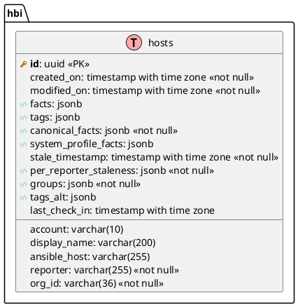
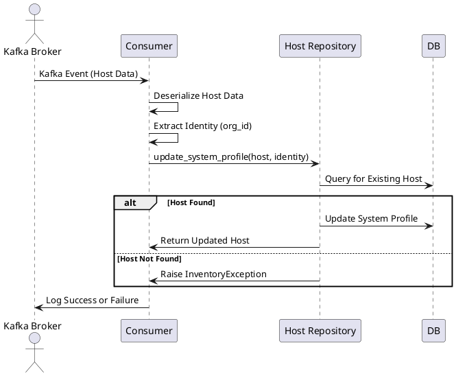

# Architecture

## Data diagram

```plantuml
@startuml hosts_table

!define table(x) entity x << (T,#FFAAAA) >>
!define primary_key(x) <b><color:#b8861b><&key></color> x</b>
!define foreign_key(x) <color:#aaaaaa><&key></color> x
!define column(x) <color:#efefef><&media-record></color> x
!define jsonb(x) <color:#80cbc4><&code></color> x

table(hbi.hosts) {
  primary_key(id): uuid <<PK>>
  column(account): varchar(10)
  column(display_name): varchar(200)
  column(created_on): timestamp with time zone <<not null>>
  column(modified_on): timestamp with time zone <<not null>>
  jsonb(facts): jsonb
  jsonb(tags): jsonb
  jsonb(canonical_facts): jsonb <<not null>>
  jsonb(system_profile_facts): jsonb
  column(ansible_host): varchar(255)
  column(stale_timestamp): timestamp with time zone <<not null>>
  column(reporter): varchar(255) <<not null>>
  jsonb(per_reporter_staleness): jsonb <<not null>>
  column(org_id): varchar(36) <<not null>>
  jsonb(groups): jsonb <<not null>>
  jsonb(tags_alt): jsonb
  column(last_check_in): timestamp with time zone
}

@enduml
```

## Basic flows

### Update host

```plantuml
@startuml
actor Kafka as "Kafka Broker"
participant SystemProfileMessageConsumer as "Consumer"
participant HostRepository as "Host Repository"
participant Database as "DB"

Kafka -> SystemProfileMessageConsumer: Kafka Event (Host Data)
SystemProfileMessageConsumer -> SystemProfileMessageConsumer: Deserialize Host Data
SystemProfileMessageConsumer -> SystemProfileMessageConsumer: Extract Identity (org_id)
SystemProfileMessageConsumer -> HostRepository: update_system_profile(host, identity)
HostRepository -> Database: Query for Existing Host
alt Host Found
    HostRepository -> Database: Update System Profile
    HostRepository -> SystemProfileMessageConsumer: Return Updated Host
else Host Not Found
    HostRepository -> SystemProfileMessageConsumer: Raise InventoryException
end
SystemProfileMessageConsumer -> Kafka: Log Success or Failure
@enduml
```
