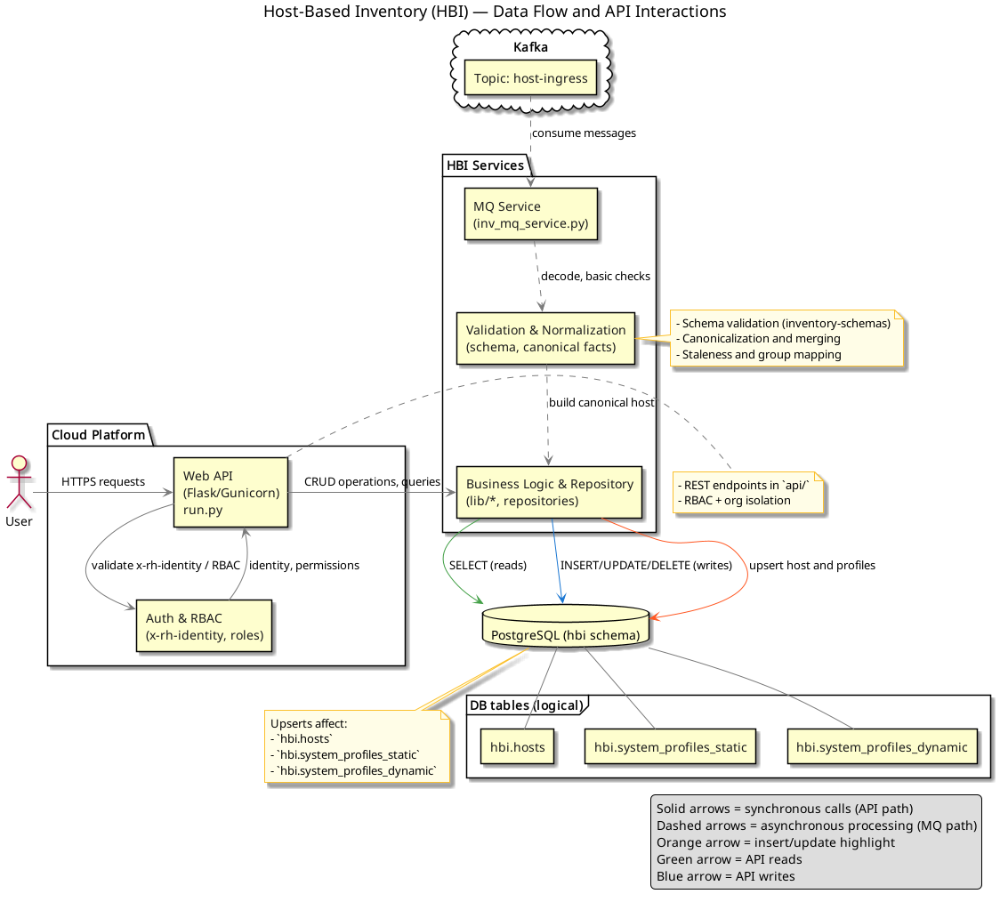
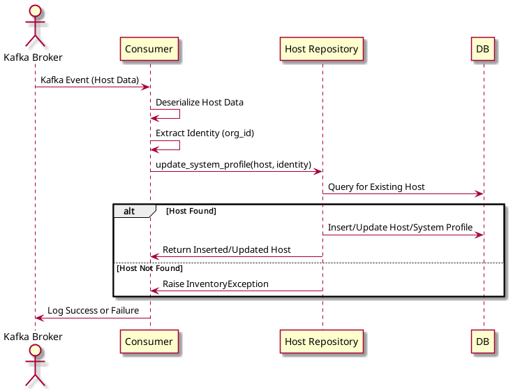

# Host Based Inventory

Host Based Inventory (HBI) is the source of truth for system, or host, information across the entire platform.
HBI consumes information about hosts from reporters, like `insights-client`, `RHSM` or `Satellite`.
In a process known as [Host Deduplication](#host-deduplication), the identity of a host is determined.
Afterwards, information about the host is persisted.

Information stored by HBI can be accessed in multiple ways:

1. [REST Interface](#rest-interface) for synchronous operations
2. [Event Interface](#event-interface) for asynchronous notifications of data and state changes
3. [Host data syndication](#host-data-syndication-aka-project-cyndi)

## HBI Architecture

Below is the HBI architecture, highlighting core components, user-to-API interactions, and the data flow from Kafka through the MQ service to PostgreSQL.



## Entity Relationship Diagram
Below you find the ERD for the HBI table:


## Host Insertion

Inventory consumes messages from host ingress topics and creates / updates host records based on these messages.

There are multiple host ingress topics.
All the topics share the same payload format.
They differ in the priority in which messages are processed by HBI.
Each topic is associated with a separate pool of consumers, each with its own resource allocation.
That allows uploads that require minimal latency (e.g.
an upload manually initiated by a customer) to be processed before other types of host messages.
The following table summarizes available host ingress topics:

|Topic |Description |Reporters using this topic
|--|--|--
|`platform.inventory.host-ingress-p1` |High priority topic. Reserved for host messages where minimal latency is required. |puptoo
|`platform.inventory.host-ingress` |Messages are processed with default priority. Suitable for reporters that produce host messages in batches or where real-time processing is not necessary. |rhsm-conduit, rhsm-system-profile-bridge, satellite, discovery, yupana, cloud-connector

For each host ingress message, HBI:

1. performs [Host Deduplication](#host-deduplication)
2. stores or updates the host record
3. produces a [created event](#created-event) or [updated event](#updated-event)

### Expected message format

HBI expects the host ingress messages to comply with the following format:

```json
{
   "operation": "add_host",
   "operation_args": {
      "defer_to_reporter": "<reporter>",
   },
   "platform_metadata": "<json_doc>",
   "data": {
      "display_name": "<display_name>",
      "ansible_host": "<ansible_host>",
      "account": "<account>",
      "org_id": "<org_id>",
      "insights_id": "<insights_id>",
      "subscription_manager_id": "<subscription_manager_id>",
      "satellite_id": "<satellite_id>",
      "fqdn": "<fqdn>",
      "bios_uuid": "<bios_uuid>",
      "ip_addresses": [<ip_addresses>],
      "mac_addresses": [<mac_addresses>],
      "facts": [<facts>],
      "tags": {<tags>},
      "system_profile": {<system_profile>},
      "reporter": "<reporter>",
   }
}
```

* operation: name of the operation to perform (only "add_host" is supported currently)
* operation_args: an optional JSON doc containing arguments that are passed to the operation. The supported arguments are as follows:
  * defer_to_reporter: an optional argument that indicates which reporter's system profile data should have priority over the system profile data provided by the caller. When an existing host entry matches the caller's report, if the staleness timestamp for *_reporter_* exists and is not stale, then the existing system profile data will *not* be replaced by the data provided by the caller.
* platform_metadata: a required JSON doc that is used to pass data associated with the host from the ingress service to the backend applications (request_id, identity, S3 bucket URL, etc)
* data: JSON doc containing data for a single Host in the above format.

In the host data, the following fields are required:

* `org_id`
* `stale_timestamp`
* `reporter`

In addition, at least one ID fact must be present to locate a host. However, if using "provider-id",
then "provider-type" MUST be provided; and if using "provider_type", then the "provider_id" MUST BE provided.
ID facts fields are:

* `provider_id`
* `subscription_manager_id`
* `insights_id`

Host `tags` should be provided using [nested representation](#nested-representation)

`"tags": {"<namespace>": {"<key>": ["<value>", …], …}, …}`


This format can be used to delete a namespace by explicitly passing it with an empty object.

`"tags": {"<namespace>": {}, …}`

NOTE: HBI also accepts host tags in the [structured representation](#structured-representation).
However, the use of this representation of tags for host ingress is *DEPRECATED* and the support will be removed in the future.

The `platform_metadata` field will be passed from the incoming host ingress message to the outgoing event message.
The data within the `platform_metadata` will not be persisted to the database.
If the `platform_metadata` contains a request_id field, the value of the request_id will be associated with all of the log messages produced by the service.

### Validation of ingress messages

Messages consumed from host ingress topics are validated against the expected message format.
Messages that don't pass validation are rejected by HBI.

Multiple tools are set up to help with analysis of rejected messages:

* A summary of rejected messages for each reporter is available in the HBI Grafana Dashboards
  * [prod Grafana Dashboard](https://grafana.app-sre.devshift.net/d/EiIhtC0Wa/inventory?orgId=1&refresh=5m)
  * [stage Grafana Dashboard](https://grafana.stage.devshift.net/d/EiIhtC0Wa/inventory?orgId=1&refresh=5m)
* Individual validation errors can be examined in the HBI logs
  * [prod Kibana](`https://kibana.apps.crcp01ue1.o9m8.p1.openshiftapps.com/app/kibana#/discover?_g=(refreshInterval:(pause:!t,value:0),time:(from:now-12h,to:now))&_a=(columns:!(_source),filters:!(),index:'43c5fed0-d5ce-11ea-b58c-a7c95afd7a5d',interval:auto,query:(language:kuery,query:'@log_stream:%20%22inventory-mq-*%22%20AND%20message:%20%22Error%20adding%20host%20%22'),sort:!(!('@timestamp',desc)))`)
  * [stage Kibana](`https://kibana.apps.crcs02ue1.urby.p1.openshiftapps.com/app/kibana#/discover?_g=(filters:!(),refreshInterval:(pause:!t,value:0),time:(from:now-12h,to:now))&_a=(columns:!(_source),filters:!(),index:'09714760-d855-11ea-9f21-6b7e641a18be',interval:auto,query:(language:kuery,query:'@log_stream:%20%22inventory-mq-*%22%20AND%20message:%20%22Error%20adding%20host%20%22'),sort:!(!('@timestamp',desc)))`)
* Validation errors that cause a payload to be rejected are also reported through Payload tracker
  * [prod Payload Tracker](https://internal.console.redhat.com/app/payload-tracker/payloads)
  * [stage Payload Tracker](https://internal.console.stage.redhat.com/app/payload-tracker/payloads)

### Insert/Update host flow
Below is the flow for the insert/update a host in the HBI database:



## Message Validation Tools

### Host-Ingress Stats Table

HBI's Grafana dashboard keeps track of multiple metrics regarding host-ingress validation.
For each reporter, [this panel]("https://grafana.app-sre.devshift.net/d/EiIhtC0Wa/inventory?viewPanel=68&orgId=1&refresh=5m&var-datasource=crcp01ue1-prometheus&var-kibana=https:%2F%2Fkibana.apps.crcp01ue1.o9m8.p1.openshiftapps.com%2Fapp%2Fkibana%23%2Fdiscover%3F_g%3D(refreshInterval:(pause:!t,value:0),time:(from:now-12h,mode:quick,to:now))%26_a%3D(columns:!(_source),index:%270a2575c0-65f9-11e9-ba88-097c6c9f6850%27,interval:auto&var-kibana_dev=https:%2F%2Fkibana-kibana.5a9f.insights-dev.openshiftapps.com%2Fapp%2Fkibana%23%2Fdiscover%3F_g%3D(refreshInterval:(pause:!t,value:0),time:(from:now-12h,mode:quick,to:now))%26_a%3D(columns:!(_source),index:d2da0310-7048-11e9-a501-7998195d35a8,interval:auto&var-kibana_prod=https:%2F%2Fkibana.apps.crcp01ue1.o9m8.p1.openshiftapps.com%2Fapp%2Fkibana%23%2Fdiscover%3F_g%3D(refreshInterval:(pause:!t,value:0),time:(from:now-12h,mode:quick,to:now))%26_a%3D(columns:!(_source),index:%270a2575c0-65f9-11e9-ba88-097c6c9f6850%27,interval:auto")
shows how many messages failed due to schema validation ("validation errors").
Each link in the table leads to a reporter-specific Kibana query that
returns a detailed list of errors that can help with debugging.

### System Profile Validator

The System Profile Validator is a job that validates changes to the
System Profile against Production data. To see how a schema change
would affect current data, open a PR to the [inventory-schemas repo](https://github.com/RedHatInsights/inventory-schemas)
with your desired modifications. `dippy-bot`, our bot account, will then
comment on the PR with a summary of the validation results per reporter,
making it clear how each reporter's messages would be affected by the
suggested change.

Users with HBI Admin permissions are also able to use the
[validator API endpoint](https://console.redhat.com/api/inventory/v1/ui/#/default/api.system_profile.validate_schema)
in any environment (Prod/Stage/etc), allowing them to validate System
Profile changes against the data from any release environment.

## Inventory Groups

Inventory groups provide a way to organize systems (or any Inventory objects) and restrict access based on organizational or technical needs.
It is not mandatory for a host to be in a group, but it can be added to a group and/or removed anytime.

Groups can be created, modified, and deleted using the user interface or API.
It is possible to select one or more systems that are going to be assigned to a group one by one or in bulk.  A system can be a member of only one group at a time.

### Group permissions

For Inventory groups, there are added permissions. These permissions are set by a global or RBAC admin.

#### Global permission

* all users with Organization admin privilege inherit the "Default admin access" and can view, create and edit groups and systems

#### Inventory Group object permission

* [read] Users can view group settings
* [write] Users can change group settings and add/remove systems from the group

#### Permission on child items (System-level permission)

* [read] Users can list and view all the systems of the specified Inventory Group(s) and their details
* [write] Users can modify (rename, delete) the systems

Additionally, [RBAC resource definitions](https://insights-rbac.readthedocs.io/en/latest/management/role.html?highlight=resource%20dinifition#resource-definitions) can be used to especify the groups each individual role has access to.

The RBAC API returns the user's permissions in the following format:
```json
{
   "meta": {
      "count": 5,
      "limit": 5,
      "offset": 0
   },
   "links": {
      "first": "/api/rbac/v1/access/?application=advisor%2Cinventory&limit=7&offset=0",
      "next": null,
      "previous": null,
      "last": "/api/rbac/v1/access/?application=advisor%2Cinventory&limit=7&offset=0"
   },
   "data": [
      {
         "resourceDefinitions": [
            {
               "attributeFilter": {
                  "key": "group.id",
                  "value": [
                     "<UUID value 1>", # Group 1
                     "<UUID value 2>", # Group 2
                     null # No group (ungrouped hosts)
                  ],
                  "operation": "in"
               }
            }
         ],
         "permission": "inventory:hosts:read"
      },
      {
         "resourceDefinitions": [], # Permission applies to all hosts
         "permission": "inventory:hosts:write"
      },
      {
         "resourceDefinitions": [],
         "permission": "inventory:groups:write"
      },
      {
         "resourceDefinitions": [],
         "permission": "inventory:groups:read"
      },
   ]
}
```

With resource definitions in place, users with the defined role can only access the groups specified in `attributeFilter`.

## Event Interface

For any host state change HBI produces an event.
These events allow applications and other platform components to get information about hosts and keep up as changes happen.

There are three types of events HBI produces: `created`, `updated` and `delete`.
All the events are sent as kafka messages to the `platform.inventory.events` kafka topic.

Every event uses the host ID as the kafka message key.
The kafka message value is specific to each event type and is described below.

In addition, each kafka message defines a set of headers:

* `event_type` - indicates the type of the event (`created`, `updated` or `delete`)
* `request_id` - the request id of the event or None/null for events that do not originate from a request
* `producer` - indicates the hostname of the pod that produced the message
* `insights_id` - the insights id of the host associated with the message or an empty string if host does not have an insights id
* `os_name` - the name of the Operating System, e.g. `RHEL`, `CentOS`
* `reporter` - the reporter that sent HBI the payload, e.g. `puptoo`, `yupana`
* `host_type` - this is set to `edge` for immutable hosts, and None/null otherwise
* `is_bootc` - indicates whether the host uses bootc

### Created event

The `created` event is produced any time a new host record is created.

```json
{
   "type": "created",
   "timestamp": "<timestamp>",
   "platform_metadata": "<metadata_json_doc>",
   "metadata": {
       "request_id": "<request_id>",
   },
   "host": {
      "id": "<id>",
      "account": "<account_number>",
      "org_id": "<org_id>",
      "display_name": "<display_name>",
      "ansible_host": "<ansible_host>",
      "fqdn": "<fqdn>",
      "insights_id": "<insights_id>",
      "subscription_manager_id": "<subscription_manager_id>",
      "satellite_id": "<satellite_id>",
      "bios_uuid": "<bios_uuid>",
      "ip_addresses": [<ip_addresses>],
      "mac_addresses": [<mac_addresses>],
      "facts": [<facts>],
      "provider_id": "<provider_id>",
      "provider_type": "<provider_type>",
      "created": "<created_date>",
      "updated": "<updated_date>",
      "stale_timestamp": "<stale_timestamp>",
      "stale_warning_timestamp": "<stale_warning_timestamp>",
      "culled_timestamp": "<culled_timestamp>",
      "reporter": "<reporter>",
      "tags": [<tags>],
      "system_profile": {<system_profile>},
      "per_reporter_staleness": {<per_reporter_staleness>},
      "groups": [{
        "id": <group_id>,
        "name": <group_name>
      }]
   }
}
```

* `type`: identifies the type of the event
* `platform_metadata`: a required json doc that contains the metadata associated with the host (identity, s3 url, request_id, etc). When the host is updated via the API, this only contains the `b64_identity` field.
* `host`: a host JSON doc containing Host data in the above format.
  * `reporter`: the name of the reporter. Currently one of `yupana`, `puptoo` or `rhsm-conduit`.

Host `tags` are formatted in the [structured representation](#structured-representation)

### Updated event

The `updated` event is produced any time changes are made to an existing host record.

```json
{
   "type": "updated",
   "timestamp": "<timestamp>",
   "platform_metadata": "<metadata_json_doc>",
   "metadata": {
       "request_id": "<request_id>",
   },
   "host": {
      "id": "<id>",
      "account": "<account_number>",
      "org_id": "<org_id>",
      "display_name": "<display_name>",
      "ansible_host": "<ansible_host>",
      "fqdn": "<fqdn>",
      "insights_id": "<insights_id>",
      "subscription_manager_id": "<subscription_manager_id>",
      "satellite_id": "<satellite_id>",
      "bios_uuid": "<bios_uuid>",
      "ip_addresses": [<ip_addresses>],
      "mac_addresses": [<mac_addresses>],
      "facts": [<facts>],
      "provider_id": "<provider_id>",
      "provider_type": "<provider_type>",
      "created": "<created_date>",
      "updated": "<updated_date>",
      "stale_timestamp": "<stale_timestamp>",
      "stale_warning_timestamp": "<stale_warning_timestamp>",
      "culled_timestamp": "<culled_timestamp>",
      "reporter": "<reporter>",
      "tags": [<tags>],
      "system_profile": {<system_profile>},
      "per_reporter_staleness": {<per_reporter_staleness>},
      "groups": [{
        "id": <group_id>,
        "name": <group_name>
      }]
   }
}
```

The full representation of the updated host (even fields that did not change) is sent always.
The format is identical to the [Created event](#created-event).
The only difference is the event type.

### Delete event

The `delete` event is produced when a host record is removed from HBI.

```json
{
  "type": "delete",
  "id": "<host id>",
  "timestamp": "<delete timestamp>",
  "account": "<account number>",
  "org_id": "<org_id>",
  "insights_id": "<insights id>",
  "request_id": "<request id>",
  "platform_metadata": "<metadata_json_doc>",
  "metadata": {
       "request_id": "<request_id>",
   },
}
```

* `type`: identifies the event type
* `id`: Inventory host id of the host that was deleted
* `timestamp`: the time at which the host was deleted
* `account`: the account number associated with the host that was deleted
* `org_id`: the org_id associated with the host that was deleted
* `insights_id`: the insights_id of the host that was deleted
* `request_id`: the identifier of the request that removed the host record (if applicable)
* `platform_metadata`: contains the `b64_identity` field. Only provided when the host was deleted via API request.

## REST Interface

The REST Interface allows host records to be read and altered using HTTP.
The interface is described by an [OpenAPI specification file](https://console.redhat.com/docs/api/inventory).

### Host Patching

The `ansible_host` and `display_name` fields can be updated by sending a [PATCH request](https://console.redhat.com/docs/api/inventory#operations-hosts-api\\.host\\.patch_by_id) to the inventory REST API.

When an update is performed, the inventory service produces an [updated event](#updated-event)
Note that in this case, the event's `platform_metadata` field only contains `b64_identity` (the request identity, base64-encoded).
There is also a `metadata` field that includes the `request_id`.

NOTE: When using PATCH endpoints, the API responds with HTTP 200 because the operation has been completed. However, the data must be propagated to Cyndi, so it may take a short while for it to be reflected in subsequent GET requests.

### Host Deletion

Hosts can be deleted by using the [DELETE HTTP method](https://console.redhat.com/docs/api/inventory#operations-hosts-api\\.host\\.delete_by_id) resource.
When a host is deleted, the inventory service produces a [delete event](#delete-event).

NOTE: When using DELETE endpoints, the API responds with HTTP 200 because the operation has been completed. However, the data must be propagated to Cyndi, so it may take a short while for it to be reflected in subsequent GET requests.

### Group Fetching

The Groups API is documented [here](https://console.redhat.com/docs/api/inventory/v1#operations-tag-groups).
Use the GET /groups API to populate a list of groups for an account.
Use the Cyndi table to filter application data joined with hosts that are in a given group.
The groups column in the Cyndi table is a JSONB column with the following structure:

```json
[{
    "id": "5ef6f06e-b400-4979-83f2-b9071fe4e754",
    "name": "a-group-name",
    "org_id": "12345",
    "account": null,
    "ungrouped": false,
    "created": "2023-04-18T13:28:57.536664+00:00",
    "updated": "2023-04-18T13:28:57.536669+00:00"
}]
```

Example SQL query for a list of reports filtered by group:

```sql
SELECT id,details,inventory.hosts.groups
FROM api_currentreport
JOIN inventory.hosts
ON inventory.hosts.id = api_currentreport.system_uuid
WHERE inventory.hosts.groups @> '[{"name": "group1"}]';
```

### Group Creation

Inventory groups can be created by sending a [group POST request](https://console.redhat.com/docs/api/inventory/v1#operations-groups-api\\.group\\.create_group) to the inventory REST API.
When a group is created and a host list is provided, the inventory service produces an [updated event](#updated-event) for each host added to the group.

### Group Patching

Inventory groups can be patched by sending a [group PATCH request](https://console.redhat.com/docs/api/inventory/v1#operations-groups-api\\.group\\.patch_group_by_id) to the inventory REST API.
Providing a list of host IDs in the request will replace the previous list of hosts associated with the group.
Additionally, new systems can be added to a group by sending a [POST request](https://console.redhat.com/docs/api/inventory/v1#operations-groups-api\\.host_group\\.add_host_list_to_group)
or deleted from it by sending a [DELETE request](https://console.redhat.com/docs/api/inventory/v1#operations-groups-api\\.host_group\\.delete_hosts_from_group).
When a group is patched, but no host ID list is provided, the inventory service produces an [updated event](#updated-event) for each of the hosts that belong to that group.
If a host ID list is provided, updated events will be produced for the removed hosts as well as for the newly added ones.

### Group Deletion

Inventory groups can be deleted by using the [DELETE HTTP method](https://console.redhat.com/docs/api/inventory/v1#operations-groups-api\\.group\\.delete_groups) resource.
When a group is deleted, the inventory service produces an [updated event](#updated-event) for each host that belonged to the group.

### Testing API Calls

It is necessary to pass an authentication header along on each call to the service.
For testing purposes, it is possible to set the required identity header to the following:

`x-rh-identity: eyJpZGVudGl0eSI6eyJvcmdfaWQiOiJ0ZXN0IiwidHlwZSI6IlVzZXIiLCJhdXRoX3R5cGUiOiJiYXNpYy1hdXRoIn19`

This is the Base64 encoding of the following JSON document:

`{"identity":{"org_id":"test","type":"User","auth_type":"basic-auth"}}`

## Host Deduplication

The Inventory service is responsible for storing information about hosts and deduplicating hosts as
they are reported. The Inventory service uses the ID facts to perform the deduplication.
The ID facts, in priority order, are:

* `provider_id` (immutable)
* `subscription_manager_id`
* `insights_id`

`provider_id` is special in that it is *immutable*. This means that it can never be updated, and
has the highest priority. If the input host has a `provider_id` and the service finds a host that
matches on that value, that host will be updated no matter what.

If the input host does not have a `provider_id`, or if no match is found, the service will compare
the remaining ID facts one at a time (in order). If a host is found that matches that ID fact, but
`provider_id` was included and doesn't match, it will create a new host; however, if `provider_id`
matches or was not provided, the host will be updated and all facts from the update request will
replace the existing facts.

If none of these searches find an existing host, then a new host entry is created.

Tag namespaces of the updated host are merged with those of the reported one.
New reported tag namespaces are added to the existing host; reported namespaces that already exist
in the existing host are replaced, the tags themselves are not merged.
If an empty namespace is explicitly reported, it is deleted from the existing host.

## Host Staleness and Culling
Staleness determines the lifespan of a host. A staleness object contains the following 3 properties that affect all types of hosts:

```
    • conventional_time_to_stale          # Time period of inactivity before the system becomes stale. Default 29 hours (Hosts are expected to check in nightly, but to accommodate for potential delays like a randomized check-in window and overnight Kafka lag, the extra 5 hours beyond the standard 24 hours provide a buffer).
    • conventional_time_to_stale_warning  # Time period of inactivity before the system is in "stale_warning" state. Default 7 days.
    • conventional_time_to_delete         # Time period of inactivity before the system is deleted from the database. Default 14 days.
```

The API also returns three additional properties - `immutable_time_to_stale`, `immutable_time_to_stale_warning`, and `immutable_time_to_delete`. However, these are deprecated and are no longer in use.

A staleness object is created by providing the “org_id” of an account and at least one of the properties with its value in seconds.  When values are not provided for these fields, default values are used.  For example, using "conventional_time_to_stale": 1, produced:

```json
{
    "id": "0fa7eb24-8993-4377-9922-5da923ba6570",
    "org_id": "test",
    "conventional_time_to_stale": 1,               # System becomes stale in one second
    "conventional_time_to_stale_warning": 604800,  # 7 days
    "conventional_time_to_delete": 1209600,        # 14 days
    "created": "2023-11-20T18:31:32.681398+00:00",
    "updated": "2023-11-20T18:31:32.681416+00:00"
}
```

Users can set custom staleness settings to suit their needs and requirements.  If the account does not have any custom staleness values set, then the default values are used to determine whether the host is stale or should be automatically deleted.

HBI may at any time stop receiving updates about a given host (e.g.  a virtual machine may be removed).

Depending on its timestamp, each host is in one of these staleness states:

* _fresh_ if the _stale_timestamp_ is in the future
* _stale_ if the _stale_timestamp_ has already lapsed, but no longer than 7 days ago
* _stale_warning_ if the host has been stale for at least 7 days, but has not yet been culled
* _culled_ if the host has been stale for at least 14 days

For each host, HBI defines 3 timestamps:

* _stale_timestamp_
* _stale_warning_timestamp_
* _culled_timestamp_

These timestamps mark the boundaries of staleness states of a host.


Culled hosts are considered non-existent and are not available through the API.
They are subject to automatic deletion by a scheduled Reaper job.

The _Host Reaper_ is run every hour and physically deletes culled hosts from the database.
For every deleted host, [delete event](#delete-event) is emitted.

Applications integrating with HBI must treat hosts in the _culled_ state as non-existent.

## Tags

A tag represents user-defined metadata about a host. HBI stores a set of tags defined for each host.

### Tag structure

A tag consists of three segments: _namespace_, _key_ and a set of _values_.

The namespace, key, and each of the values are:

* a string of at least 1 and no more than 255 Unicode characters in UTF-8
* case-sensitive

In addition

* a tag is required to have a key
* a tag may define zero, one or multiple values
* the order of tag values is not significant

### Tag representation

There are three standard representations of host tags.
Each of these representations has different properties and is therefore better suited for certain situations.
The following tag is used across the examples below to demonstrate how the representations differ.

* namespace = `insights-client`
* key = `env`
* value = `prod`

#### Structured representation

This is the default representation of tags and is preferred for tag data exchange using REST or event interfaces.

A tag is represented by one or more objects, each explicitly defining the namespace, key and value:

```json
{
   "namespace": "insights-client",
   "key": "env",
   "value": "prod"
}
```

If a tag defines no values then this is indicated with `"value": null`.

A tag with multiple values ([.title-ref]#prod#, [.title-ref]#stage#) is represented as two separate objects:

```json
[{
   "namespace": "insights-client",
   "key": "env",
   "value": "prod"
}, {
   "namespace": "insights-client",
   "key": "env",
   "value": "stage"
}]
```

#### Nested representation

In the nested representation the tags are represented as an object with three levels of nesting.
These levels correspond to namespace, key and values, respectively.

```json
{
   "insights-client": {
      "env": [
         "prod"
      ]
   }
}
```

If a tag defines no values then this is indicated with empty array on the third level:

```json
{
   "insights-client": {
      "env": []
   }
}
```

A tag with multiple values (`prod`, `stage`) lists all the values in the third level array:

```json
{
   "insights-client": {
      "env": [
         "prod",
         "stage"
      ]
   }
}
```

#### String representation

In certain situations a single-string representation of a namespace + key + value may be preferred.
For example, when sending tag information using HTTP query parameters.

In the string representation the namespace, key and value are concatenated.
`/` and `=` are used as control characters to separate the individual segments.

`insights-client/env=prod`

The fact that a namespace, key or value can contain `/` and `=` characters creates a potential ambiguity when parsing a tag in the string representation.
In order to avoid this ambiguity it is required that `/` and `=` characters that occur in the namespace, key or value are escaped using RFC3986 (URI encoding).
More specifically, when transforming a tag into the string representation the following rules apply for namespace, key or value:

* `/` is replaced with `%2F`
* `=` is replaced with `%3D`

For example, the following tag:

* namespace: `insights-client`
* key: `selinux-config`
* value: `SELINUX=enforcing`

is represented using string representation as:

`insights-client/selinux-config=SELINUX%3Denforcing`

Note that in transit (e.g.  when sent as an HTTP query parameter value) the tag will be URI-encoded again (as required by RFC3986).
This happens automatically in modern HTTP browsers and http client libraries.
This should not be confused with the aforementioned encoding of the tag segments described above which the client must always do.

If a tag defines no values then this is indicated as `insights-client/env`

A tag with multiple values (`prod`, `stage`) is represented with multiple String instances (e.g. in case of HTTP query parameters)

`GET /hosts?tags=insights-client/env=prod&tags=insights-client/env=stage`

### Using Tags in queries

This section defines semantics of query operations that involve tags.
For consistency it is vital that applications integrating with HBI follow these guidelines.

#### Filtering hosts by tags

A common use-case for tags is to use them for filtering of hosts.
Besides filtering a list of hosts directly, tags can be used to filter aggregations (count of hosts with the given tag), associated information (CVEs that apply to the hosts with the given tag), etc.

The tag that is used for filtering is said to be the _requested tag_.
An _available tag_ is any tag associated with a given system.

A host is considered to match the requested tag if and only if an available tag is defined by the hosts which:

* defines a namespace that is equal to the namespace of the requested tag
* defines a key that is equal to the key of the requested tag
* defines a set of values that matches the values of the requested tag
** the set of values of the requested tag is an empty set and the available tag defines no values, or
** the set of values of the requested tag is a non-empty set and this set is a subset of values defined by the available tag

It is possible to filter by multiple tags at the same time.
In that case, a host must match all the requested tags.

See [/hosts](https://console.redhat.com/docs/api/inventory#operations-hosts-api\.host\.get_host_list) for the reference implementation of host filtering based on tags.

#### Examples

Assume the following set of hosts

|Host |Tags defined by the host
|--|--
|example01 a|<code>insights-client/http-server<br>insights-client/env=prod</code>
|example02 a|<code>insights-client/http-server=cgi<br>insights-client/env=prod<br>insights-client/env=stage</code>
|example03 a|<code>insights-client/http-server=cgi<br>insights-client/http-server=tls<br>insights-client/http-server=http2<br>insights-client/env=stage</code>

A sample query of `/hosts?tags=insights-client/env=prod` matches two hosts (example01, example02).
In this case the requested tag defines

* namespace = `insights-client`
* key = `env`
* value = `prod`

example01 and example02 both match the requested tag because they both define a tag that

* defines the same namespace (`insights-client`)
* defines the same key (`env`)
* defines a set of values (`{prod}` in case of example01, `{prod, stage}` in case of example02) that matches the values of the requested tag (`{prod}`)
  * `{prod}` is a subset of `{prod}` and `{prod`, `stage}`

example03 does not match because while it defines a tag whose namespace and key match (`insights-client/env=stage`), its values do not match the requested tag (`{prod}` is not empty neither is a subset of `{stage}`).

The following table summarizes other combinations of requested tags and matched hosts:

|Requested tags |Matched hosts
|--|--
|<code>insights-client/http-server=cgi</code>|<code>* example02<br>* example03</code>
|<code>insights-client/http-server=cgi<br>insights-client/http-server=tls</code>|<code>* example03</code>
|<code>insights-client/http-server</code>|<code>* example01</code>
|<code>insights-client/http-server<br>insights-client/env=stage</code>|no hosts matched


#### Query syntax

Applications integrating with HBI that provide a tag-based filtering capability via a REST interface should implement an HTTP query parameter named `tags`.

`?tags=insights-client/env=prod`

Filtering by a combination of multiple tags or by a tag with multiple values should be supported by the tags parameter accepting multiple values.

`?tags=insights-client/env=prod&tags=insights-client/http-server=cgi`

## System Profile

HBI stores a set of currated facts, also known as _system profile_, for each host.
The system profile contains general facts about a host such as OS version, Kernel version, CPU architecture, etc.

The system profile is stored in 2 tables, the system_profiles_static and system_profiles_dynamic table as you can see at the [HBI EDR](#entity-relationship-diagram).

System profile facts are reported by reporters in the [host insertion](#host-insertion) process.
All the system profile facts are optional, i.e.
a reporter does not need to specify any.
If a reporter does specify a system profile fact, then its value overrides the previously stored value of the given fact (if any) in a shallow merge.
Any previously stored system profile facts that a reporter does not define remain unchanged.

### Using System Profile in queries

Applications integrating with HBI may provide querying capabilities that use system profile facts for host filtering.
Applications that do so via a REST interface should follow a standardized format in order for consistency to be achieved across applications.

To filter based on system profile facts, applications should define a query parameter named `filter`.
The query parameter should be of type [deep object](https://swagger.io/docs/specification/serialization) and follow the generic filter query parameter syntax below.

|Field Type | Supported Comparators | description
|--|--|--
|String | eq | Case-sensitive string match
|Wildcard String | eq | Case-sensitive string match
| | matches | Case-sensitive string matching with wildcard (*) support
|Integer | eq | Integer match
|Boolean | eq | Boolean match

Arrays of types support array comparators in addition to the scalar comparators listed above.

|Field Type | Supported Comparators | description
|--|--|--
|String Array | contains | Array contains case-sensitive string match
|Wildcard String Array| contains | Array contains case-sensitive string match

There are some custom types that use a special format.

|Field | Supported Comparators | description
|--|--|--
|operating_system[<name>][version] | eq | Version match (major OR major.minor)
| | gte | Greater than or equal to (major OR major.minor)
| | gt | Greater than (major OR major.minor)
| | lte | Less than or equal to (major OR major.minor)
| | lt | Less than (major OR major.minor)


Below is a list of some system profile fields for reference.

|Field |Type |Example
|--|--|--
|workloads[sap][sap_system] |Boolean |true
|workloads[sap][sids] |String |AEC
|insights_client_version | Wildcard String |6*
|is_marketplace |Boolean |true
|operating_system |String |7.5
|owner_id |UUID |0892cd6b-c564-4f53-a0cb-0784d79ee323
|host_type |String |edge

Here's how it looks in practice. For example we'll look at insights_client_version.

To query for hosts with insights client version 7 and any minor version, the query parameter should be defined as:

`?filter[system_profile][insights_client_version]=7.*`

This can also be done with an explicit comparator selection like in the example below. This example is equivalent to the one above because if no comparator is specified, eq is used.

`?filter[system_profile][insights_client_version][eq]=7.*`

To query for hosts used for SAP, the query parameter should be defined as:

`?filter[system_profile][workloads][sap][sap_system][eq]=true`

To find hosts with an empty or missing os_kernel_version, the nil value can be used:

`?filter[system_profile][os_kernel_version][is]=nil`

To find hosts that are using RHEL 7.5:

`?filter[system_profile][operating_system][RHEL][version][eq]=7.5`

To find hosts that are using RHEL 8 and above:

`?filter[system_profile][operating_system][RHEL][version][gte]=8`

#### Queryable system profile fields
Most system profile facts may be used in filter queries, however there are a few exceptions. Fields marked with the `x-indexed: false` property in the [system profile schema](https://github.com/RedHatInsights/inventory-schemas/blob/master/schemas/system_profile/v1.yaml) may not be used in filter queries.

### Fetching Sparse System Profile fieldsets

When fetching system profile fields for a host or list of hosts, the user can restrict the system profile fields that get fetched using the sparse fieldsets functionality. HBI follows the sparse fieldsets query defined by the [JSON API specification](https://jsonapi.org/format/#fetching-sparse-fieldsets) and the functionality is currently supported for top-level fields only. If a specified field does not exist on the System Profile schema, the server will respond with HTTP 400.

For example, to only fetch the `arch`, `yum_repos` and `os_kernel_version`, the user needs to add the following query to the `/hosts/\{host_id_list}/system_profile` endpoint:

`?fields[system_profile]=arch,yum_repos,os_kernel_version`

In addition to the /hosts/{host_id_list}/system_profile endpoint, this query can also be used on the upper-level /hosts endpoint to fetch partial system profile data for hosts. On the /hosts endpoint, if this query is not included, no system profile data will be returned.

## Identity Requirements

To create, update and access host data, the provided identity must comply with the following logic:

* it must contain an org_id
* identity must be of type `System` or `User`
* the identity auth type must be one of:
  * `basic-auth`, `cert-auth`, `jwt-auth`, or `uhc-auth`

If the identity type is `System`, the `system` object should be present in the identity, and it must additionally comply with the following logic:

* the fields `cert-type` and `cn` must be present within the `system` object
* the `cert-type` must be one of:
  * `hypervisor`, `rhui`, `sam`, `satellite` or `system`
* the value provided in `cn` must be equal to the `owner_id` of the host being added or updated

Host update messages received over `platform.inventory.system-profile` topic do not need to provide an identity.

The following must be true for `add_host` messages received over `platform.inventory.host-ingress` and `platform.inventory.host-ingress-p1`.

* they must contain `platform_metadata` and the `b64_identity` field must be encoded within the `platform_metadata`, except when the reporter is `rhsm-conduit`
* for an existing host, the `owner_id` of the host must match the value in `system.cn` of the identity

If the reporter is `rhsm-conduit` and an identity is not provided, adding or updating hosts over `platform.inventory.host-ingress` and `platform.inventory.host-ingress-p1` will follow this logic:

* `subscription_manager_id` must be present
* the host's `owner_id` gets set to its `subscription_manager_id`

## Host Data Syndication (a.k.a. Project Cyndi)

Besides accessing host data via HBI interfaces, it is possible to syndicate host data directly into an application database.
This is especially useful when host data needs to be joined with application-specific data and filtered based on combination of app-specific and HBI-specific criteria.
Such queries are efficient with host data syndication as they benefit from the fact that the data is co-located in a single database.

Applications that use host data syndication have an _inventory_ schema in their database.
The schema contains host data and this schema is kept up to date with HBI as changes are made in HBI.
The inventory schema is completely managed by the Inventory workstream.


### Onboarding process

The onboarding process varies based on the environment.
For self-managed (legacy CI and QA) environments, follow the steps in the next section.
For environments managed by AppSRE via app-interface, skip ahead to [Onboarding process (App-Interface)](#onboarding-process-app-interface)

IMPORTANT: The cyndi-init script is currently broken. The manual (self-managed) onboarding steps must be used.

#### Onboarding process (Self-managed environment)

In order to integrate an application with Project Cyndi the following steps need to be followed:

1. Ensure that the application database matches the following criteria:
    * AWS RDS instance of type _large_ or better
    * PostgreSQL version 10.6 or higher
    * At least 200 GiB of free storage capacity
2. Determine the type of host syndication needed by the application, either:
    1. _all_ - all inventory hosts are syndicated, or
    2. _insights only_ - only Insights hosts are syndicated (i.e. only hosts reporting through insights-client)

    The latter option should be preferred unless the application also processes data related to hosts other than the Insights ones

3. The application superuser creates an `inventory` schema in the application database

      `CREATE SCHEMA inventory;`

      The inventory schema is where syndicated host data is stored.

4. The application superuser creates `cyndi_reader` and `cyndi_admin` roles and the `cyndi` user

         -- The admin ROLE that allows the inventory schema to be managed
         CREATE ROLE cyndi_admin;
         GRANT ALL PRIVILEGES ON SCHEMA inventory TO cyndi_admin;

         -- The reader ROLE that provides SELECT access to the inventory.hosts view
         CREATE ROLE cyndi_reader;
         GRANT USAGE ON SCHEMA inventory TO cyndi_reader;

         -- The application user is granted the reader role only to eliminate any interference with Cyndi
         GRANT cyndi_reader to <application username>;

         -- Create a user for Cyndi with cyndi_admin ROLE
         -- Used by Project Cyndi to access the database and manage the inventory schema
         CREATE USER cyndi WITH PASSWORD '<password>' IN ROLE cyndi_admin;

         -- Ensure that a user for Cyndi is allowed to login granting it LOGIN attribute explicitly
         ALTER ROLE cyndi WITH LOGIN;

      Where

      * `<application username>` is the username used by the application when accessing the database
      * `<password>` is a newly generated secure password

5. Contact [@project-cindy-dev](https://app.slack.com/client/T026NJJ6Z/browse-user-groups/user_groups/S014H1A3AH0) and provide the following information

      * application name (e.g. _advisor_)
      * desired host syndication type (_all_ or _insights only_)
      * database hostname
      * database name
      * database password for the _cyndi_ user

#### Onboarding process (App-Interface)

IMPORTANT: This is currently broken. Please follow the manual steps above. See https://issues.redhat.com/browse/ESSNTL-2368

In order to integrate an application with Project Cyndi the following steps need to be followed:

1. Ensure that the application database matches the following criteria:

      * AWS RDS instance of type _large_ or better
      * PostgreSQL version 10.6 or higher
      * At least 200 GiB of free storage capacity

2. Determine the type of host syndication needed by the application, either:

      1. _all_ - all inventory hosts are syndicated, or
      2. _insights only_ - only Insights hosts are syndicated (i.e. only hosts reporting through insights-client)

      The latter option should be preferred unless the application also processes data related to hosts other than the Insights ones

3. Configure the `cyndi-init` job that sets up the application database to be managed by Cyndi.

      1. Locate the application's `app.yml` file (`data/services/insights/<application name>/app.yml`) and add the `inventory-syndication` entry into the `codeComponents` list:

            codeComponents:
            - name: inventory-syndication
            resource: upstream
            url: https://github.com/redhatinsights/inventory-syndication

      2. Locate the application's `deploy.yml` file (`data/services/insights/<application name>/deploy.yml`) and make sure that the `managedResourceTypes` list contains `Job` and `ConfigMap`. Add the missing resource type(s) if needed.

            managedResourceTypes:
            - ConfigMap
            - Job

      3. In the `deploy.yml` ensure that `github-app-sre-bot` is defined in the `authentication.code` section.

            authentication:
            code:
               path: app-sre/creds/github-app-sre-bot
               field: openshift-saas-deploy

      4. Finally, add a `cyndi-init` resource template definition to the application's `deploy.yml` file.

            resourceTemplates:
            - name: cyndi-init
            path: /openshift/cyndi-init.yml
            url: https://github.com/redhatinsights/inventory-syndication
            targets:
            - namespace:
                  $ref: /services/insights/<application name>/namespaces/<namespace>.yml
               ref: 165cd33c70fd50be977a5584ab13b4f28502a442
               parameters:
                  APP_NAME: <application name>
                  APP_ROLE: <application username>
                  DB_SECRET: <db secret>
                  IMAGE_TAG: "3a34b0c"

         Where

         ____
         * `<application name>` is the name of the application (e.g. advisor)
         * `<namespace>` is the target OpenShift namespace
         * `<application username>` is the username used by the application when accessing the database (this user will be granted access to `inventory.hosts` view)
         * `<db secret>` is the name of the OpenShift secret containing superuser credentials for the application database
         ____

         Submit these changes as a merge request to [app-interface](https://gitlab.cee.redhat.com/service/app-interface). After the merge request has been merged, a Pod named `cyndi-init-<application-name>-1-<id>` will be started automatically to set up the database. As part of the set up:

         * the `inventory` schema is created - syndicated host data is stored here
         * `cyndi_reader` and `cyndi_admin` roles are created
         * `cyndi` user is created and granted the `cyndi_admin` role - Project Cyndi will use this user to log into the application database

4. Once the application database has been set up, contact [@project-cyndi-dev](https://app.slack.com/client/T026NJJ6Z/browse-user-groups/user_groups/S014H1A3AH0) and provide the following information
* application name (e.g. _advisor_)
* desired host syndication type (_all_ or _insights only_)
* database identifier

### Usage

Host records are accessed using the _inventory.hosts_ view.
The view contains the following columns:

<table><tr><td>column </td><td>type </td><td>nullable </td><td>description</td></tr>
<tr><td><code>id</code> </td><td><code>uuid</code> </td><td>no </td><td>host identifier</td></tr>
<tr><td><code>account</code> </td><td><code>character varying(10)</code> </td><td>no </td><td>A Red Hat account number that the host belongs to.</td></tr>
<tr><td><code>org_id</code> </td><td><code>character varying(36)</code> </td><td>no </td><td>A Red Hat org_id that the host belongs to.</td></tr>
<tr><td><code>display_name</code> </td><td><code>character varying(200)</code> </td><td>no </td><td>A host's human-readable display name.</td></tr>
<tr><td><code>created</code> </td><td><code>timestamp with time zone</code> </td><td>no </td><td>A timestamp when the record was created.</td></tr>
<tr><td><code>updated</code> </td><td><code>timestamp with time zone</code> </td><td>no </td><td>A timestamp when the record was last updated.</td></tr>
<tr><td><code>stale_timestamp</code> </td><td><code>timestamp with time zone</code> </td><td>no </td><td>Timestamp from which the host is considered </td></tr>stale. See <<Host Staleness and Culling>> for details.
<tr><td><code>stale_warning_timestamp</code> </td><td><code>timestamp with time zone</code> </td><td>no </td><td>Timestamp from which the host is </td></tr>considered too stale to be listed without an explicit toggle. See <<Host Staleness and Culling>> for details.
<tr><td><code>culled_timestamp</code> </td><td><code>timestamp with time zone</code> </td><td>no </td><td>Timestamp from which the host is considered </td></tr>deleted. See <<Host Staleness and Culling>> for details.
<tr><td><code>insights_id</code> </td><td><code>uuid</code></td><td>yes </td><td></td></tr>
<tr><td><code>reporter</code> </td><td><code>character varying(255)</code></td><td>no </td><td></td></tr>
<tr><td><code>per_reporter_staleness</code> </td><td><code>jsonb</code></td><td>no </td><td></td></tr>
<tr><td><code>groups</code> </td><td><code>jsonb</code></td><td>yes </td><td></td></tr>
<tr><td><code>tags</code> </td><td><code>jsonb</code> </td><td>no </td><td>The set of tags of a host. Stored in the structured representation.</td></tr>
<tr><td><code>system profile</code> </td><td><code>jsonb</code> </td><td>no </td><td>

A set of facts about a host. Currently, only the following <a href="https://github.com/RedHatInsights/inventory-schemas/blob/master/schemas/system_profile/v1.yaml">system_profile attributes</a> are syndicated:

<ul>
<li>ansible</li>
<li>sap</li>
<li>sap_system</li>
<li>sap_sids</li>
<li>operating_system</li>
<li>owner_id</li>
<li>rhc_client_id</li>
<li>rhsm</li>
<li>bios_vendor</li>
<li>bios_version</li>
<li>bios_release_date</li>
<li>infrastructure_type</li>
<li>host_type</li>
<li>mssql</li>
<li>system_update_method</li>
<li>workloads</li>
</ul>

More keys will be added in the future.
</td></tr>
|`insights_id` |`uuid` |yes |The insights identifier of the given host or null if the given host does not have one.
|###
</table>

WARNING: Besides the _inventory.hosts_ view, there are multiple tables inside the _inventory_ schema. These are used internally for host data syndication. An application *MUST NOT* use these tables directly. Instead, all queries should be made via the _inventory.hosts_ view.

#### Example

Assume a simple application that analyzes what CVEs a given host is vulnerable to and stores these associations in its own database. The database tables used by the application look like this:

```sql
CREATE TABLE cves (
    id VARCHAR(20) PRIMARY KEY,
    cvss3_score NUMERIC(5,3)
);

-- associative entity referencing HBI host records by their id
CREATE TABLE host_cves (
    host_id UUID,
    cve_id VARCHAR(20),
    PRIMARY KEY (host_id, cve_id)
);
```

With host data syndication, the application can access host record data directly in the database queries. For example, a list of hosts affected by _CVE-2019-11135_ and ordered by hosts' _display_name_ can be obtained using:

```sql
SELECT inventory.hosts.id, inventory.hosts.display_name
FROM host_cves
INNER JOIN inventory.hosts ON (host_cves.host_id = inventory.hosts.id)
WHERE host_cves.cve_id = 'CVE-2019-11135'
```

The _inventory.hosts_ view can be used to implement stale host filtering. The following query adds a `stale_warning_timestamp` expression to the WHERE clause. As a result, only hosts that are _fresh_ or _stale_ are returned.

```sql
SELECT inventory.hosts.id, inventory.hosts.display_name
FROM host_cves
INNER JOIN inventory.hosts ON (host_cves.host_id = inventory.hosts.id)
WHERE
    host_cves.cve_id = 'CVE-2019-11135' AND
    inventory.hosts.stale_warning_timestamp > NOW()
```

Applications integrating with HBI should follow host staleness guidelines defined in <<Host Staleness and Culling>>.

The syndicated view can be used for <<Filtering hosts by tags,filtering hosts by tags>>.
Here, the query is modified so that only hosts tagged with `insights-client/env=prod` tag are returned:

```sql
SELECT inventory.hosts.id, inventory.hosts.display_name
FROM host_cves
INNER JOIN inventory.hosts ON (host_cves.host_id = inventory.hosts.id)
WHERE
    host_cves.cve_id = 'CVE-2019-11135' AND
    inventory.hosts.stale_warning_timestamp > NOW() AND
    inventory.hosts.tags @> '[{"namespace":"insights-client", "key":"env", "value":"prod"}]'
```

Filtering by host tags should follow syntax and semantic guidelines defined in [filtering hosts by tags](#filtering-hosts-by-tags).

Similarly, the syndicated view can be used for filtering based on [system profile](#system-profile).
The following query demonstrates how non-SAP hosts are filtered out:

```sql
SELECT inventory.hosts.id, inventory.hosts.display_name
FROM host_cves
INNER JOIN inventory.hosts ON (host_cves.host_id = inventory.hosts.id)
WHERE
    host_cves.cve_id = 'CVE-2019-11135' AND
    inventory.hosts.stale_warning_timestamp > NOW() AND
    inventory.hosts.system_profile @> '{"workloads": {"sap": {"sap_system": true}}}'
```

Filtering by system profile facts should follow guidelines defined in [using System Profile in queries](#using-system-profile-in-queries).

### Limitations

The following limitations apply on the syndicated _inventory_ schema:

* The syndicated data is read-only.
  An application MUST NOT use INSERT, UPDATE or DELETE operations on _inventory_ schema objects.
* The syndicated data is eventually consistent with HBI.
  There is always a delay between a when change is made in HBI and when this change becomes visible in the syndicated inventory schema.
  During peaks or incidents this delay may increase.
* Ordering of updates across hosts is not guaranteed.
  If a change to host2 is made in HBI after a change to host1 is made then the change to host2 may become visible in the syndicated schema before the change to host1.
* When referencing syndicated host records from application-specific tables, foreign key constraints MUST NOT be used.
  Doing so may lead to application data loss or prevent host data syndication from working properly.
* Triggers SHOULD NOT be defined on tables in the _inventory_ schema.
  Instead, the application should consume [event interface](#event-interface) events to be notified when a host is created / updated / removed.

NOTE: These limitations are enforced automatically when the _inventory_ schema is accessed using the _cyndi_reader_ role.
It is recommended that applications log in to the database server using credentials of a user with the _cyndi_reader_ role instead of using superuser credentials.

#### Local development

Applications integrated with Cyndi can be developed locally without having to provision all of the Cyndi components in the local environment.
This [seed script](https://github.com/RedHatInsights/inventory-syndication/blob/master/utils/seed-local.sql) can be extended to set up a Cyndi-like schema in the local database and seed it with sample host data.

## Contributing

If you're interested in contributing, check out the [Github repo](https://github.com/RedHatInsights/insights-host-inventory).
