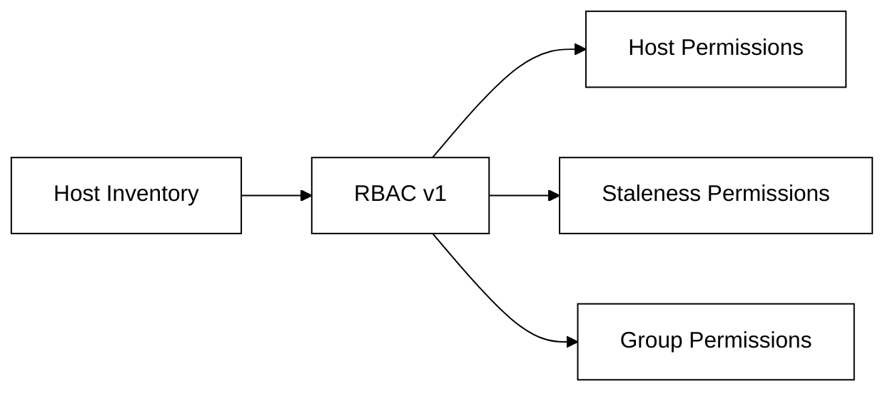
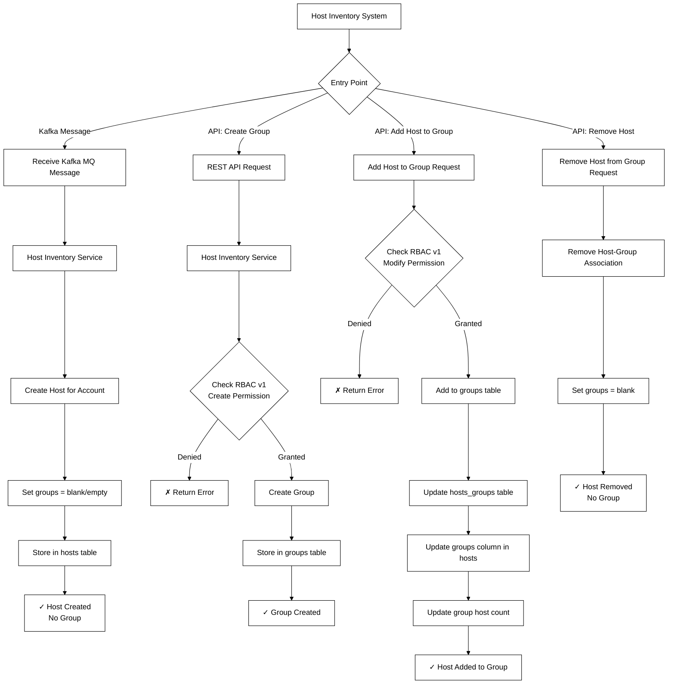
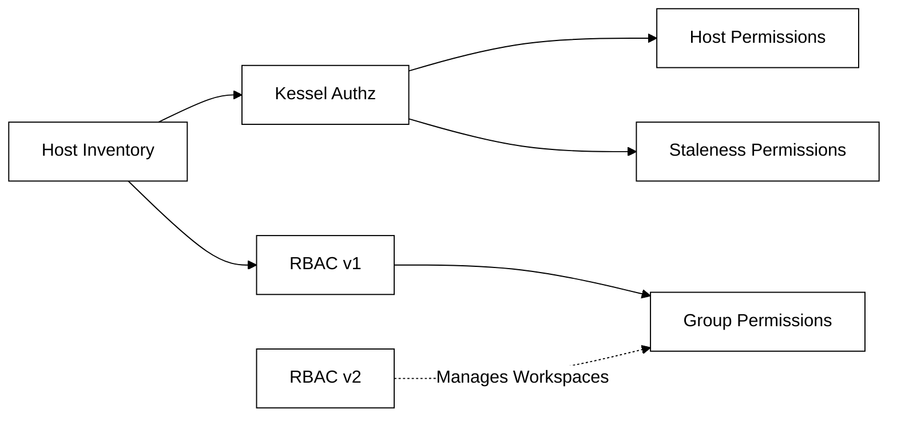
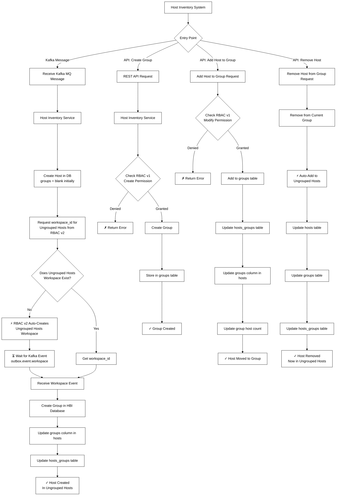

# Kessel Effects on Host Inventory Service - Combined Workflows

[← Back to Kessel Effects on HBI](kessel-effects-on-hbi.md)

## Overview

This document presents consolidated flowcharts showing all major workflows before and after Kessel integration. Each section starts with a single entry point and shows all possible scenarios side by side.

---

## Before Kessel

[← Back to Before Kessel Section](kessel-effects-on-hbi.md#before-kessel)

### Authorization Model

### Workflows Combined

### Key Characteristics - Before Kessel

- **Single Authorization Source**: RBAC v1 handles all permissions (hosts, staleness, groups)
- **Optional Group Membership**: Hosts can exist without being in a group (blank `groups` column)
- **Synchronous Operations**: Direct database updates without event-driven coordination
- **Simple Workflows**: Straightforward request-response patterns
- **Four Main Entry Points**:
  1. **Kafka Message** → Host Creation (ungrouped)
  2. **API: Create Group** → Group Creation
  3. **API: Add Host to Group** → Host-Group Association
  4. **API: Remove Host** → Host becomes ungrouped

---

## With Kessel

[← Back to With Kessel Section](kessel-effects-on-hbi.md#with-kessel)

### Authorization Model

### All Workflows

### Key Characteristics - With Kessel

- **Hybrid Authorization**: Kessel Authz (hosts/staleness) + RBAC v1 (groups) + RBAC v2 (workspace management)
- **Mandatory Group Membership**: Every host must belong to a group at all times
- **Event-Driven Architecture**: Asynchronous updates via Kafka topic `outbox.event.workspace`
- **Automatic Workspace Creation**: RBAC v2 auto-creates "Ungrouped Hosts" workspace when needed
- **Complex Workflows**: Event-driven patterns with wait states for coordination
- **Four Main Entry Points**:
  1. **Kafka Message** → Host Creation (always in a group - Ungrouped Hosts if not specified)
  2. **API: Create Group** → Group Creation
  3. **API: Add Host to Group** → Host moves between groups
  4. **API: Remove Host** → Host automatically moves to Ungrouped Hosts

---

## Side-by-Side Comparison

| Aspect | Before Kessel | With Kessel |
|--------|--------------|-------------|
| **Authorization** | Single source (RBAC v1) | Hybrid (Kessel Authz + RBAC v1/v2) |
| **Host Grouping** | Optional - can be ungrouped | Mandatory - always in a group |
| **Ungrouped Hosts** | Blank `groups` column allowed | Auto-assigned to "Ungrouped Hosts" workspace |
| **Workflow Pattern** | Synchronous, direct DB updates | Asynchronous, event-driven (Kafka) |
| **Workspace Management** | N/A | RBAC v2 auto-creates workspaces |
| **Event Topics** | None | `outbox.event.workspace` |
| **Complexity** | Simple, straightforward | Complex, with wait states |

---

## Key Differences in Workflows

### 1. Host Creation
- **Before**: Simple 5-step process, host exists without group
- **After**: Complex 13-step process with RBAC v2 interaction, Kafka events, and mandatory group assignment

### 2. Group Creation
- **Before**: 7 steps with RBAC v1 check
- **After**: Same 7 steps (unchanged workflow)

### 3. Add Host to Group
- **Before**: 8 steps with RBAC v1 check
- **After**: 8 steps (similar workflow, but host is moving from one group to another)

### 4. Remove Host from Group
- **Before**: 4 steps, host becomes ungrouped
- **After**: 7 steps, host automatically assigned to "Ungrouped Hosts" workspace

---

## Related Resources

- [Kessel Project Documentation](https://project-kessel.github.io/)
- RBAC v1 and v2 integration documentation
- Kafka topic: `outbox.event.workspace` - Workspace lifecycle events
- [Original detailed documentation](kessel-effects-complete.md)
