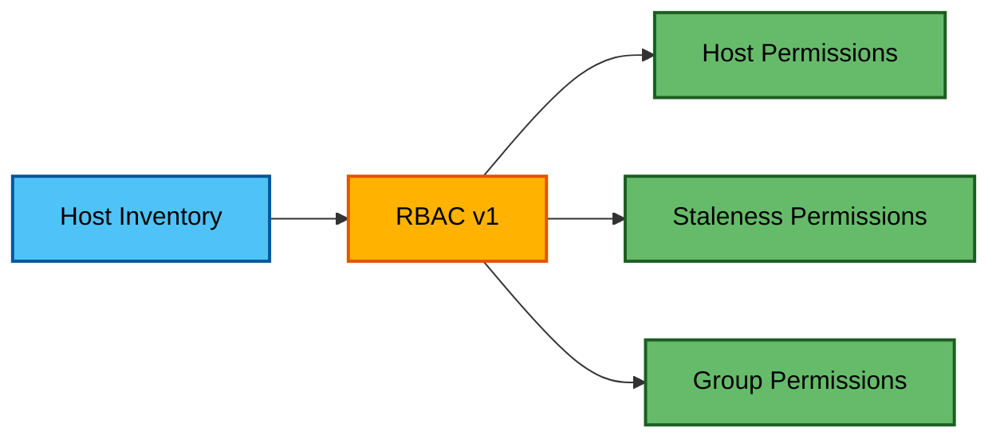
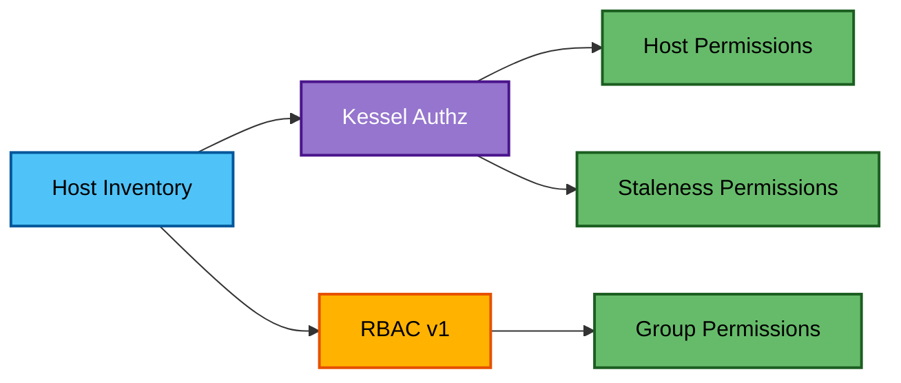
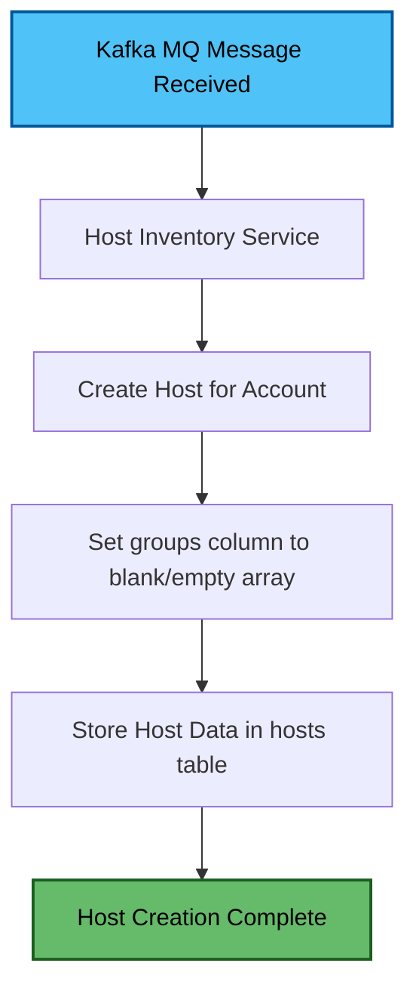
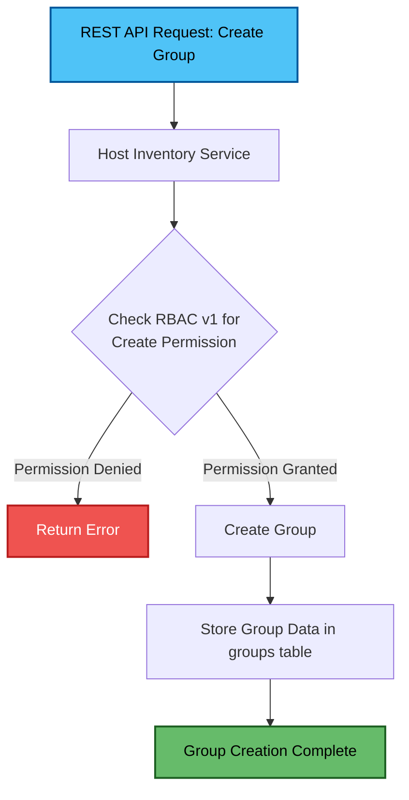
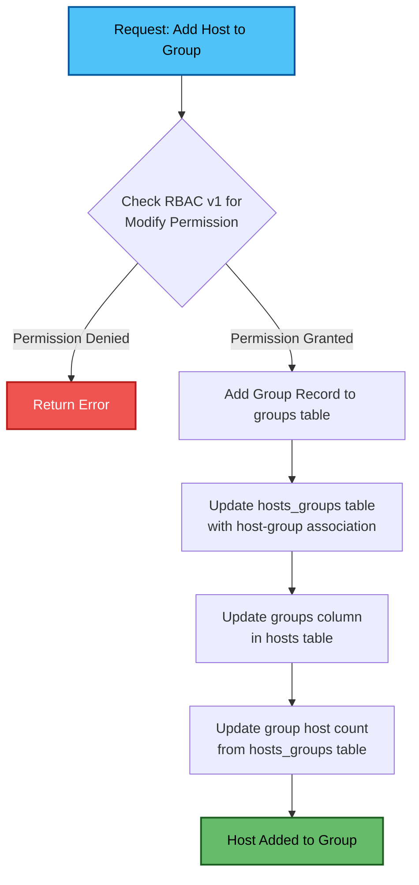
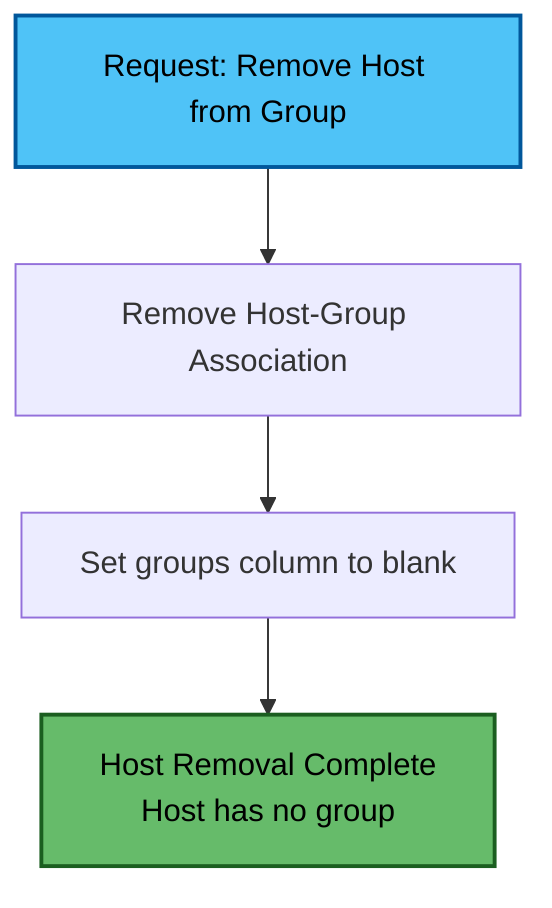
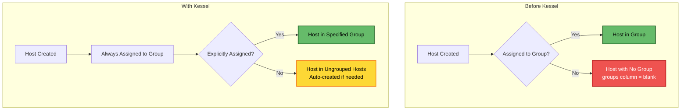
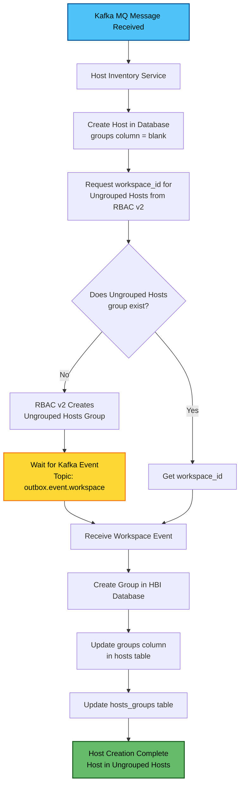
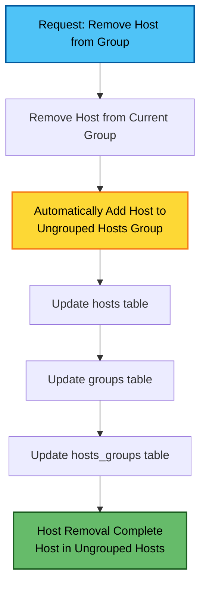

# Kessel Effects on Host Inventory Service

## Overview

[Kessel](https://project-kessel.github.io/) defines itself as:
> "In the simplest terms, Kessel is an inventory of resources, how they relate to one another, and how they change over time. A resource can be anything: a file, a virtual white board, a Linux host, a Kubernetes cluster, and so on."

From the Host-Based Inventory (HBI) perspective, **hosts**, **staleness**, and **groups** are the resources that Kessel maintains inventory of.

---

## Impact on Authorization

The primary effect of Kessel on Host Inventory is how it interacts with RBAC (Role-Based Access Control):

### Text Description

- **Pre-Kessel**: RBAC v1 provided access permissions for all resources (hosts, staleness, and groups)
- **Post-Kessel**: Hybrid authorization model
  - **RBAC v2**: Provides permissions for `hosts` and `staleness`
  - **RBAC v1**: Continues to provide permissions for `groups`
  - **Note**: In RBAC v2, groups are called "workspaces" and are stored in the RBAC database

### Authorization Flow - Before Kessel

### Authorization Flow - With Kessel

---

## Before Kessel

### Host Creation

#### Process Description
1. Hosts were created upon receiving MQ (Kafka) messages
2. Host Inventory created hosts for the account from which the message was received
3. After creation, the `groups` column was blank or contained `[]`
4. Host data was stored in the `hosts` table

#### Flow Chart

---

### Group Creation

#### Process Description
1. Groups were created, updated, and deleted via REST API
2. When a group creation request was received:
   - Host Inventory checked with RBAC v1 for user permissions
   - If permission granted, the group was created
   - Group data was stored in the `groups` table

#### Flow Chart

---

### Host Addition to Group

#### Process Description
1. RBAC v1 was checked for permission to modify the group
2. If permission granted:
   - New group record added to the `groups` table
   - `hosts_groups` table updated with the host-group association
   - Host's `groups` column updated
   - Group's host count updated (counted from `hosts_groups` table)

#### Flow Chart

---

### Host Removal from Group

#### Process Description
- When a host was removed from a group, the `groups` column was left blank

#### Flow Chart

---

### Key Characteristics (Pre-Kessel)
1. RBAC v1 provided all permissions (hosts, staleness, groups)
2. Hosts could exist without group membership (blank `groups` column)

---

## With Kessel

### Authorization Changes

#### Process Description
- Kessel Authz holds permissions (view, update, or delete) for hosts and staleness

---

### Automatic Group Association

**Every host must be associated with a group.** When not explicitly assigned to a group, hosts are automatically associated with the **"Ungrouped Hosts"** group.

#### Host Group Association - Comparison

---

### Host Creation Workflow

#### Process Description
1. Host Inventory creates the host and saves it to the database with blank `groups` column
2. Host Inventory requests the `workspace_id` for "Ungrouped Hosts" from RBAC v2
3. If the account doesn't have an "Ungrouped Hosts" group:
   - RBAC v2 creates one automatically
4. Host Inventory waits for the group creation event:
   - Listens for Kafka message on topic: `outbox.event.workspace`
5. Upon receiving the workspace event:
   - Creates the group in HBI database
   - Updates the `groups` value for the host in `hosts` table
   - Updates the `hosts_groups` table

#### Flow Chart

---

### Removing Host from Group

#### Process Description
When a host is removed from a group:
1. Host is automatically added to the "Ungrouped Hosts" group
2. All relevant tables are updated:
   - `hosts` table
   - `groups` table
   - `hosts_groups` table

#### Flow Chart

---

## Key Differences Summary

| Aspect | Before Kessel | After Kessel |
|--------|--------------|--------------|
| **Authorization Provider** | RBAC v1 only | Kessel Authz + RBAC v1 |
| **Host Permissions** | RBAC v1 | Kessel Authz |
| **Group Permissions** | RBAC v1 | RBAC v1 |
| **Ungrouped Hosts** | Allowed (blank `groups`) | Not allowed (auto-assigned to "Ungrouped Hosts") |
| **Group Creation** | Manual via API | Manual via API + automatic "Ungrouped Hosts" creation |
| **Event-Driven Updates** | No | Yes (Kafka topic: `outbox.event.workspace`) |

---

## Flow Chart Legend

- 🔵 **Blue** - Start/Input events
- 🟡 **Yellow** - Important waiting/event-driven steps
- 🟢 **Green** - Completion/Success states
- 🔴 **Red** - Error/Denied states
- 🟣 **Purple** - Kessel Authz
- 🟠 **Orange** - RBAC v1

---

## Key Implementation Notes

1. **Event-Driven Architecture**: The "With Kessel" workflows introduce Kafka-based event-driven updates (topic: `outbox.event.workspace`)
2. **Mandatory Group Association**: Post-Kessel, every host must belong to a group - the "Ungrouped Hosts" group serves as the default
3. **Hybrid Authorization**: Kessel uses both RBAC v2 (for hosts/staleness) and RBAC v1 (for groups/workspaces)
4. **Automatic Group Creation**: RBAC v2 automatically creates an "Ungrouped Hosts" workspace if it doesn't exist

---

## Related Resources

- [Kessel Project Documentation](https://project-kessel.github.io/)
- RBAC v1 and v2 integration documentation
- Kafka topic: `outbox.event.workspace` - Workspace lifecycle events
