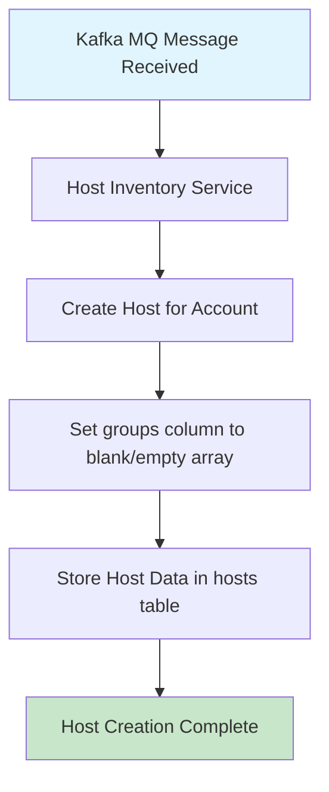
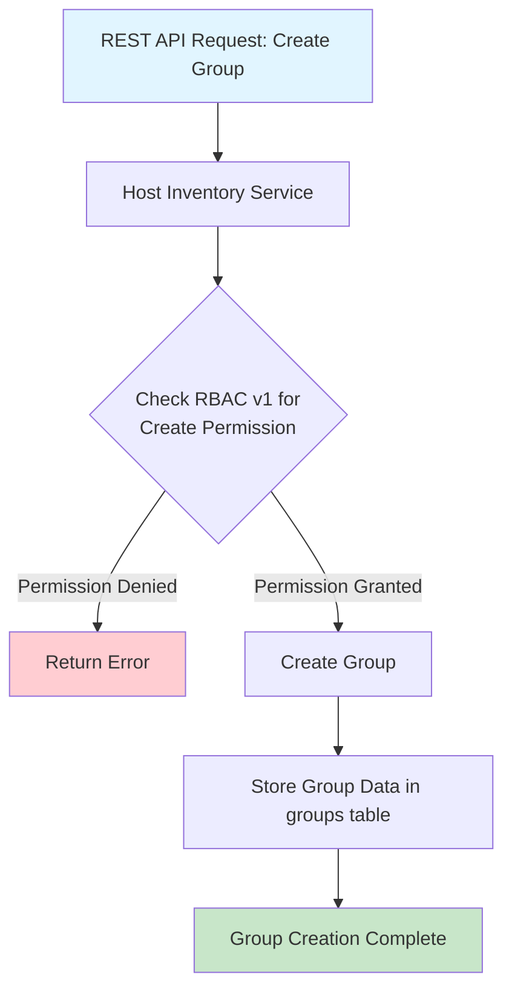
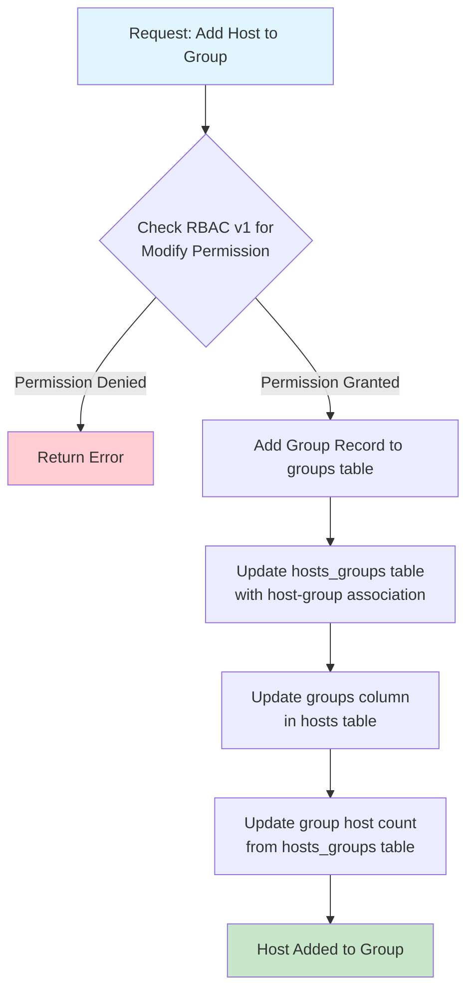
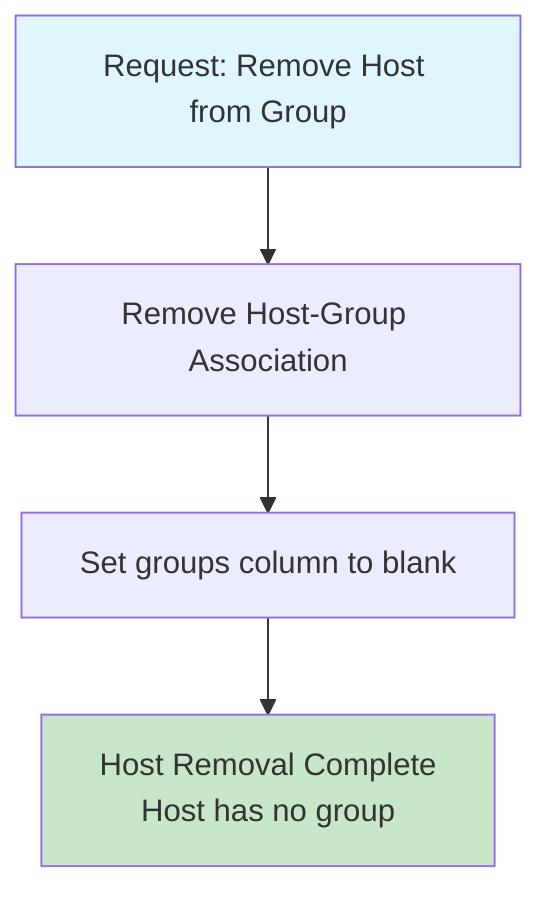
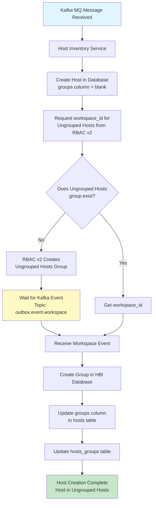
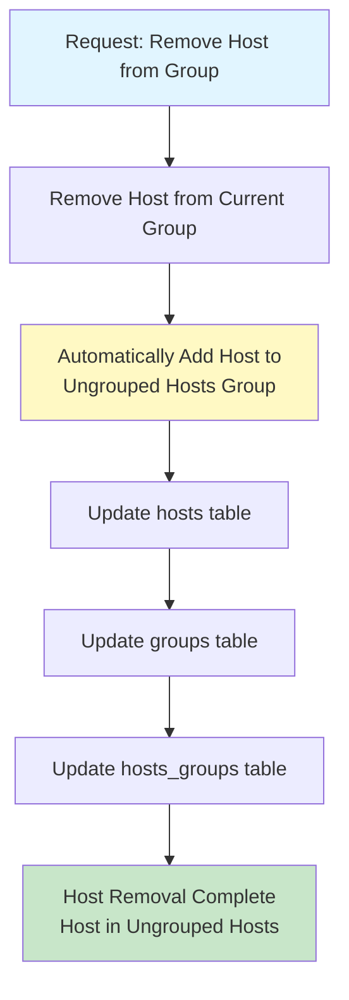
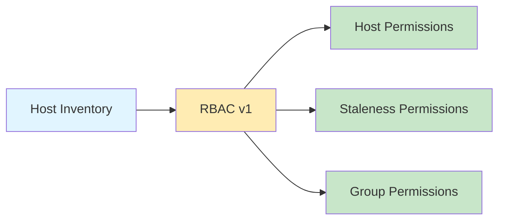
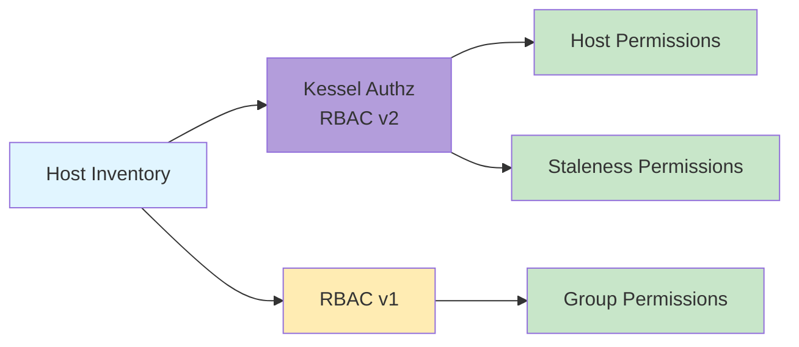
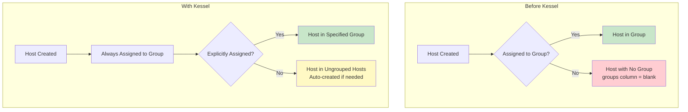

# Kessel Effects on Host Inventory - Process Flow Charts

This document provides visual flow charts for the key processes described in the Kessel Effects on Host Inventory Service documentation.

## Table of Contents
- [Before Kessel Workflows](#before-kessel-workflows)
  - [Host Creation (Pre-Kessel)](#host-creation-pre-kessel)
  - [Group Creation (Pre-Kessel)](#group-creation-pre-kessel)
  - [Host Addition to Group (Pre-Kessel)](#host-addition-to-group-pre-kessel)
  - [Host Removal from Group (Pre-Kessel)](#host-removal-from-group-pre-kessel)
- [With Kessel Workflows](#with-kessel-workflows)
  - [Host Creation Workflow (With Kessel)](#host-creation-workflow-with-kessel)
  - [Host Removal from Group (With Kessel)](#host-removal-from-group-with-kessel)
- [Authorization Comparison](#authorization-comparison)

---

## Before Kessel Workflows

### Host Creation (Pre-Kessel)

### Group Creation (Pre-Kessel)

### Host Addition to Group (Pre-Kessel)

### Host Removal from Group (Pre-Kessel)

---

## With Kessel Workflows

### Host Creation Workflow (With Kessel)

### Host Removal from Group (With Kessel)

---

## Authorization Comparison

### Authorization Flow - Before Kessel

### Authorization Flow - With Kessel

---

## Key Workflow Changes

### Host Group Association - Comparison

---

## Legend

- 🔵 **Light Blue** - Start/Input events
- 🟡 **Yellow** - Important waiting/event-driven steps
- 🟢 **Green** - Completion/Success states
- 🔴 **Red** - Error/Denied states
- 🟣 **Purple** - Kessel Authz/RBAC v2
- 🟠 **Orange** - RBAC v1

---

## Notes

1. **Event-Driven Architecture**: The "With Kessel" workflows introduce Kafka-based event-driven updates (topic: `outbox.event.workspace`)
2. **Mandatory Group Association**: Post-Kessel, every host must belong to a group - the "Ungrouped Hosts" group serves as the default
3. **Hybrid Authorization**: Kessel uses both RBAC v2 (for hosts/staleness) and RBAC v1 (for groups/workspaces)
4. **Automatic Group Creation**: RBAC v2 automatically creates an "Ungrouped Hosts" workspace if it doesn't exist

---

## Related Documentation

- [Kessel Effects on Host Inventory Service](./kessel-effects-on-hbi.md) - Detailed documentation
- [Kessel Project Documentation](https://project-kessel.github.io/)
